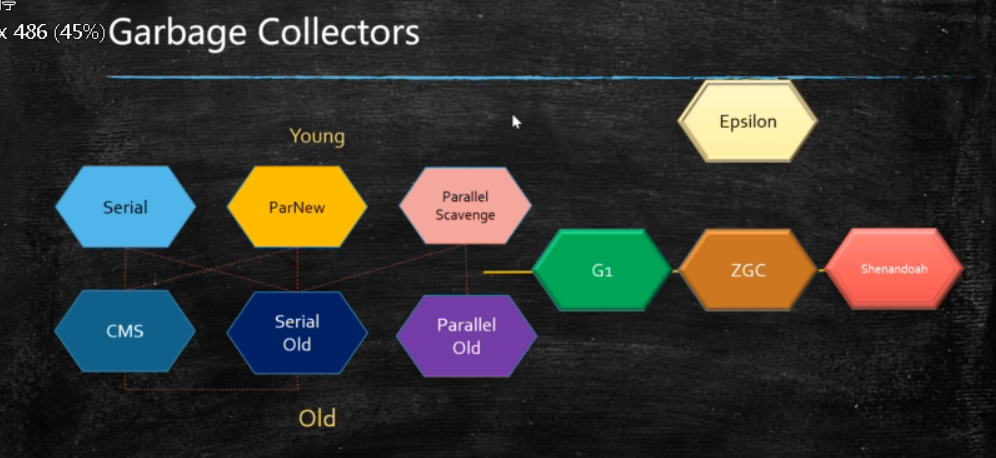

# GC和GC Tuning

作者：马士兵教育 http://mashibing.com

### GC的基础知识

#### 1.什么是垃圾

> C语言申请内存：malloc free
>
> C++： new delete
>
> Java: new ？
>
> 自动内存回收，编程上简单，系统不容易出错，手动释放内存，容易出两种类型的问题：
>
> 1. 忘记回收
> 2. 多次回收

没有任何引用指向的一个对象或者多个对象（循环引用）

#### 2.如何定位垃圾

1. 引用计数
2. 根可达算法

(根对象包括哪些？线程栈变量、静态变量、常量池、JNI指针)

#### 3.常见的垃圾回收算法

1. 标记清除 - 位置不连续 产生碎片
2. 拷贝算法 - 没有碎片，浪费空间
3. 标记压缩 - 没有碎片，效率偏低

#### 4.JVM内存分代模型（用于分代垃圾回收算法）

1. 部分垃圾回收器使用的模型
2. 新生代 + 老年代 + 永久代（1.7）/ 元数据区(1.8) Metaspace
   1. 永久代 元数据 - Class
   2. 永久代必须指定大小限制 ，元数据可以设置，也可以不设置，无上限（受限于物理内存）
   3. 字符串常量 1.7 - 永久代，1.8 - 堆
   4. MethodArea逻辑概念 - 永久代、元数据
3. 新生代 = Eden + 2个suvivor区  (Eden : suvivor : suvivor = 8 : 1 : 1)
   1. YGC回收之后，大多数的对象会被回收，活着的进入s0
   2. 再次YGC，活着的对象eden + s0 -> s1
   3. 再次YGC，eden + s1 -> s0
   4. 年龄足够 -> 老年代 （15 CMS 6）
   5. s区装不下 -> 老年代
4. 老年代
   1. 顽固分子
   2. 老年代满了FGC Full GC
5. GC Tuning (Generation)
   1. 尽量减少FGC
   2. MinorGC = YGC
   3. MajorGC = FGC

#### 5.常见的垃圾回收器

1. Serial 年轻代 串行回收
2. PS 年轻代 并行回收
3. ParNew 年轻代 配合CMS的并行回收
4. SerialOld 
5. ParallelOld
6. ConcurrentMarkSweep 老年代 并发的， 垃圾回收和应用程序同时运行，降低STW的时间(200ms)
7. G1(10ms)
8. ZGC (1ms) PK C++
9. Shenandoah
10. Eplison

1.8默认的垃圾回收：PS + ParallelOld

#### 6.JVM调优第一步，了解生产环境下的垃圾回收器组合

* JVM的命令行参数参考：https://docs.oracle.com/javase/8/docs/technotes/tools/unix/java.html

* JVM参数分类

  > 标准： - 开头，所有的HotSpot都支持
  >
  > 非标准：-X 开头，特定版本HotSpot支持特定命令
  >
  > 不稳定：-XX 开头，下个版本可能取消

  -XX:+PrintCommandLineFlags 

  -XX:+PrintFlagsFinal 最终参数值

  -XX:+PrintFlagsInitial 默认参数值

### 参考资料

1. [https://blogs.oracle.com/
    ](https://blogs.oracle.com/jonthecollector/our-collectors)[jonthecollector](https://blogs.oracle.com/jonthecollector/our-collectors)[/our-collectors](https://blogs.oracle.com/jonthecollector/our-collectors)
2. https://docs.oracle.com/javase/8/docs/technotes/tools/unix/java.html
3. http://java.sun.com/javase/technologies/hotspot/vmoptions.jsp