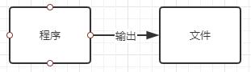
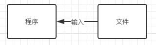

# 数据流的基本概念

几乎所有的程序都离不开信息的输入和输出，比如从键盘读取数据，从文件中获取或者文件中存入数据，在显示器上显示数据。这些情况下都会涉及有关输入/输出的处理。

在Java中，把这些不同类型的输入、输出源抽象为流（Stream），其中输入或输出的数据称为数据流（Data Stream），用统一的接口来表示

# IO流的分类

数据流是指一组有顺序的、有起点和终点的字节集合。

- 按照流的流向分，可以分为**输入流**和**输出流**。注意：这里的输入、输出是针对程序来说的。

输出：把程序（内存）中的内容输出到磁盘、光盘等存储设备中。

输入：读取外部数据（磁盘、光盘等存储设备的数据）到程序（内存）中。

- 按照处理数据单位不同分为**字节流**和**字符流**。

字节流：每次读取（写出）一个字节，当传输的资源文件有中文时，会出现乱码。

> 1字符=2字节；1字节（byte）=8位（bit）；一个汉字占两个字节长度。

字符流：每次读取（写出）两个字节，有中文时，使用该流就可以正确传输显示中文。

- 按照流的角色划分为**节点流**和**处理流**。

节点流：从或向一个特定的地方（节点）读写数据。如FileInputStream。

处理流（包装流）：是对一个已存在的流的连接和封装，通过所封装的流的功能调用实现数据读写。如BufferedReader。处理流的构造方法总是要带一个其他的流对象做参数。一个流对象经过其他流的多次包装，称为流的链接。

https://baijiahao.baidu.com/s?id=1659851047751244423&wfr=spider&for=pc

