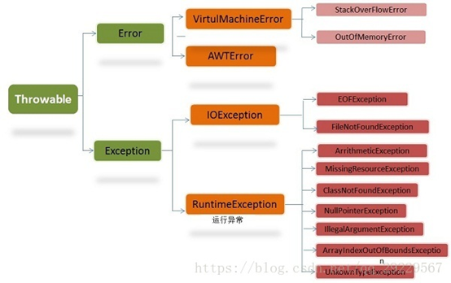

# Java 基本类型和引用类型

## 数据类型

Java中的数据类型分为两大类，基本数据类型和引用数据类型。**

### 1、基本数据类型

基本数据类型只有8种，可按照如下分类
①整数类型：`long、int、short、byte`
②浮点类型：`float、double`
③字符类型：`char`
④布尔类型：`boolean`

| No.  |      数据类型      | 大小/位 |              可表示数据范围              |  默认值  |
| :--: | :----------------: | :-----: | :--------------------------------------: | :------: |
|  1   |  `byte`（字节型）  |    8    |                 -128~127                 |    0     |
|  2   | `short`（短整型）  |   16    |               -32768~32767               |    0     |
|  3   |   `int`（整型）    |   32    |          -2147483648~2147483647          |    0     |
|  4   |  `long`（长整型）  |   64    | -9223372036854775808~9223372036854775807 |    0     |
|  5   | `float`（单精度）  |   32    |              -3.4E38~3.4E38              |   0.0    |
|  6   | `double`（双精度） |   64    |             -1.7E308~1.7E308             |   0.0    |
|  7   |   `char`（字符）   |   16    |                  0~255                   | '\u0000' |
|  8   | `boolean`（布尔）  |    -    |               true或false                |  false   |

### 2、引用数据类型

引用数据类型非常多，大致包括：
类、 接口类型、 数组类型、 枚举类型、 注解类型、 字符串型

例如，`String`类型就是引用类型。
**简单来说，所有的非基本数据类型都是引用数据类型。**

## 基本数据类型和引用数据类型的区别

### 1、存储位置

#### 基本变量类型

- 在方法中定义的非全局基本数据类型变量的具体内容是存储在栈中的

#### 引用变量类型

- 只要是引用数据类型变量，其具体内容都是存放在堆中的，而栈中存放的是其具体内容所在内存的地址
  *ps:通过变量地址可以找到变量的具体内容，就如同通过房间号可以找到房间一般*

```java
public class Main{
   public static void main(String[] args){
       //基本数据类型
       int i=1;
       double d=1.2;
       
       //引用数据类型
       String str="helloworld";
   }
}
```


### 2、传递方式

#### 基本变量类型

- 在方法中定义的非全局基本数据类型变量，调用方法时作为参数是按**数值传递**的

```java
//基本数据类型作为方法参数被调用
public class Main{
   public static void main(String[] args){
       int msg = 100;
       System.out.println("调用方法前msg的值：\n"+ msg);    //100
       fun(msg);
       System.out.println("调用方法后msg的值：\n"+ msg);    //100
   }
   public static void fun(int temp){
       temp = 0;
   }
}
```


#### 引用变量类型

- 引用数据类型变量，调用方法时作为参数是按**引用传递**的

```java
//引用数据类型作为方法参数被调用

class Book{
    String name;
    double price;

    public Book(String name,double price){
        this.name = name;
        this.price = price;
    }
    public void getInfo(){
        System.out.println("图书名称："+ name + "，价格：" + price);
    }

    public void setPrice(double price){
        this.price = price;
    }
}

public class Main{
   public static void main(String[] args){
       Book book = new Book("Java开发指南",66.6);
       book.getInfo();  //图书名称：Java开发指南，价格：66.6
       fun(book);
       book.getInfo();  //图书名称：Java开发指南，价格：99.9
   }

   public static void fun(Book temp){
       temp.setPrice(99.9);
   }
}
```

**调用时为temp在栈中开辟新空间，并指向book的具体内容，方法执行完毕后temp在栈中的内存被释放掉**


## 比较

当两个基本类型使用”==”比较时，他们比较的是**值**。 
当两个引用类型使用”==”比较时，他们比较的是**地址**。 
当两个引用类型使用方法equals()比较时，他们比较的是**值**。

```java
int i = 1234;
Integer i1 = new Integer(1234);
Integer i2 = new Integer(1234);
System.out.print("i1 == i2 : "+(i1 == i2));
System.out.println("\ti1.equals(i2) : "+(i1.equals(i2)));
System.out.print("i == i1 : "+(i == i1));
System.out.println("\t\ti1.equals(i) : "+(i1.equals(i)));
System.out.print("i == i2 : "+(i == i2));
System.out.println("\t\ti2.equals(i) : "+(i2.equals(i)));

```

打印： 
i1 == i2 : false i1.equals(i2) : true 
i == i1 : true i1.equals(i) : true 
i == i2 : true i2.equals(i) : true

我们可以看到 i == i1, i == i2, i1 != i2, 
但使用equals()他们都是相等的。

equals()源码

```java
public boolean equals(Object obj) {
        return this == obj;
    }
```

Integer重写equals()方法

```java
public boolean equals(Object obj) {
        if (obj instanceof Integer) {
            return this.value == (Integer)obj;
        } else {
            return false;
        }
    }
```


# JAVA代码执行顺序

```java
class HelloA {

       public HelloA(){
           System.out.println("Hello A!父类构造方法");
       }

      {        System.out.println("i'm A class.父类非静态代码块");


      }
      static{
           System.out.println("static A 父类静态代码块");
       }
}

     class HelloB extends HelloA {
        public HelloB(){
            System.out.println("Hello B! 构造方法");
        }
        {
            System.out.println("i'm B class.非静态代码块");
        }
        static{
            System.out.println("static B 静态代码块");
        }
        public static void main(String[] args) {
            System.out.println("---start---");
            new HelloB();
            new HelloB();
            System.out.println("---end---");
        }
}

```

**打印结果**

static A 父类静态代码块
static B 静态代码块
---start---
i'm A class.父类非静态代码块
Hello A!父类构造方法
i'm B class.非静态代码块
Hello B! 构造方法
i'm A class.父类非静态代码块
Hello A!父类构造方法
i'm B class.非静态代码块
Hello B! 构造方法
---end---

# 异常



## **Throwable**

**Throwable**有两个重要的子类：**Exception**（异常）和**Error**（错误），二者都是Java异常处理的重要子类，各自都包含大量子类。异常和错误的区别是：异常能被程序本身处理，错误无法处理。

## **Error（错误）**

**Error**是程序无法处理的错误，表示运行应用程序中较严重的问题。大多数错误与代码编写者执行的操作无关，而表示代码运行时JVM（Java虚拟机）出现的问题。例如，Java虚拟机运行错误（Virtual MachineError），当JVM不再有继续执行操作所需的内存资源时，将出现OutOfMemoryError。

这些异常发生时，Java虚拟机（JVM）一般会选择线程终止。这些错误表示故障发生于虚拟机自身、或者发生在虚拟机试图执行应用时，如Java虚拟机运行错误（Virtual MachineError）、类定义错误（NoClassDefFoundError）等。这些错误是不可查的，因为它们在应用程序的控制和处理能力之外，而且绝大多数是程序运行时不允许出现的状况。对于设计合理的应用程序来说，即使确实发生了错误，本质上也不应该试图去处理它所引起的异常状况。在Java中，错误通过Error的子类描述。

## **Exception（异常）**

**Exception**是程序本身可以处理的异常。其中可以分为两大类：

- 运行时异常
- 非运行时异常

### **运行时异常**

RunTimeException类及其子类异常，如NullPointerException（空指针异常）、IndexOutOfBoundsException（下标越界异常）等，这些异常是不检查异常，程序中可以选择捕获处理，也可以不处理。这些异常一般是由程序逻辑错误引起的，程序应该从逻辑角度尽可能避免这类异常的发生。

​    运行时异常的特点是Java编辑器不会检查它，也就是说，当程序中可能出现这类异常，即使没有用try-catch语句捕获它，也没有用throws子句生命抛出它，也会编译通过。

### **非运行时异常（编译异常）**

RuntimeException以外的异常，类型上都属于Exception类及其子类。从程序语法角度讲必须进行处理的异常，如果不处理，程序就不能编译通过。如IOException、SQLException等以及用户自定义的Exception异常，一般情况下不自定义检查异常。

## **异常处理机制**

Java中异常处理机制有，抛出异常、捕获异常。

如果一个方法可能会出现异常，但没有能力处理这种异常，可以在方法声明处用throws或throw来抛出异常。

### **Throws**

throws语句用在方法定义时声明该方法要抛出的异常类型，如果抛出的是Exception异常类型，则该方法被声明为抛出所有的异常。多个异常可使用逗号分割。

格式如下：

```java
public void test() throws Exception,ClassNotFoundException{
    //TODO
}

```

方法名后的Exception1，Exception2…为声明要抛出的异常列表。当方法抛出异常列表的异常时，方法将不对这些类型及其子类类型的异常作处理，而抛向调用该方法的方法，由他去处理。

### **Throw**

throw总是出现在方法体中，用来抛出一个Throwable类或者其子类的实例对象异常。格式如下

```java
throw new IOException();
```

程序会在throw语句后立即终止，它后面的语句执行不到（除了之后的finally），然后在包含它的所有try块中（可能在上层调用函数中）从里向外寻找含有与其匹配的catch子句的try块。

# 匿名类

Java 语音规范上是这么描述匿名类的

匿名类的声明是由Java编译器自动派生自一个类实例创建表达式。

匿名类永远不能是抽象的。

匿名类总是隐式的final。

匿名类总是一个内部类；并且不能是static的。

例子

> 接口中使用"default"关键字，实现接口的时候可以不实现此方法。

```java
public interface TestInterface {
    int getCount();
    String getName();
    default String getOther(){
        return "123";
    }
}
```

```java
TestInterface testInterface = new TestInterface() {
            @Override
            public int getCount() {
                return 0;
            }

            @Override
            public String getName() {
                return null;
            }
        };
        testInterface.getOther();
```

# *Lambda* 表达式

## 创建线程

普通创建线程

```java
new Thread(new Runnable() {
            @Override
            public void run() {
                System.out.println("123");
            }
        }).start();
```

Lambda表达式创建

```java
new Thread(() -> System.out.println("456"),"a1").start();
```

## 遍历集合

普通遍历

```java
for (Book book : bookList) {
            System.out.println(book.getBookName());
            System.out.println(book.getBookId());
        }
```

Lambda表达式遍历

```java
bookList.forEach(book -> System.out.println("book = " + book.getBookName()));
```


