# JAVA代码执行顺序

```java
class HelloA {

       public HelloA(){
           System.out.println("Hello A!父类构造方法");
       }

      {        System.out.println("i'm A class.父类非静态代码块");


      }
      static{
           System.out.println("static A 父类静态代码块");
       }
}

     class HelloB extends HelloA {
        public HelloB(){
            System.out.println("Hello B! 构造方法");
        }
        {
            System.out.println("i'm B class.非静态代码块");
        }
        static{
            System.out.println("static B 静态代码块");
        }
        public static void main(String[] args) {
            System.out.println("---start---");
            new HelloB();
            new HelloB();
            System.out.println("---end---");
        }
}

```

**打印结果**

static A 父类静态代码块
static B 静态代码块
---start---
i'm A class.父类非静态代码块
Hello A!父类构造方法
i'm B class.非静态代码块
Hello B! 构造方法
i'm A class.父类非静态代码块
Hello A!父类构造方法
i'm B class.非静态代码块
Hello B! 构造方法
---end---

# 多线程与高并 发

## 进程、线程、纤程

### 什么是进程、线程（面试高频）

回答1：进程就是一个程序运行起来的状态，线程是一个进程中不同的执行路径。

回答2（专业）：进程是OS分配资源的进本单位，线程是执行调度的基本单位。

### 进程

**概念：** Linux中也称为task，是系统分配资源的基本单位。

**资源：** 独立的地址空间，内核数据结构，全局变量数据段。

**僵尸进程：** 父进程产生子进程后，会维护子进程的一个PCB结构，子进程退出，由父进程释放。如果父进程没有释放，那么子进程成为一个僵尸进程。

**孤儿进程：** 子进程结束之前，父进程已经退出。（孤儿进程会成为init进程的孩子，由1号进程维护）

**进程调度：** 内核进程调度器决定。

1. 该哪一个进程运行。
2. 何时开始。
3. 运行多长时间。

Linux中每一个进程都有自己的调度方案。

### 线程

**概念：** 一个程序里不同的执行路径。

#### **线程常用方法：** 

1. start()：线程启动

2. wait()：使线程处于一种等待状态，释放所持有的对象锁。正因为wait方法会释放锁，所以调用该方法时，当前的线程必须拥有当前对象的锁。

3. sleep()：当前线程暂停一段时间让给其他线程。是一个静态方法，调用它时要捕获InterruptedException异常，不释放对象锁。

4. join()：当我们调用某个线程的这个方法时，这个方法会挂起调用线程，直到被调用线程结束执行，调用线程才会继续执行。

5. yield()：yield()的作用是让步。它能让当前线程由“运行状态”进入到“就绪状态”，从而让其它具有相同优先级的等待线程获取执行权；但是，并不能保证在当前线程调用yield()之后，其它具有相同优先级的线程就一定能获得执行权；也有可能是当前线程又进入到“运行状态”继续运行！

6. notify()：唤醒一个正在等待状态的线程。注意调用此方法时，并不能确定唤醒的是哪一个等待状态的线程，是由JVM来决定唤醒哪个线程，不是由线程优先级决定的。

7. notiflyAll()：唤醒所有等待状态的线程，注意并不是给所有唤醒线程一个对象锁，而是让它们竞争。

#### **线程创建的几种方式**

1、继承Thread类创建线程。

（1）   定义Thread类的子类MyThread，并重写run()方法，run()方法的方法体（线程执行体）就是线程要执行的任务。

（2）   创建MyThread类的实例

（3）   调用子类实例的start()方法来启动线程。

例：

```java
public class Mythread extends Thread {
	
	private int i;
	public void run(){//run()是线程类的核心方法
		for(int i=0;i<10;i++){
			System.out.println(this.getName()+":"+i);
		}
	}
	public static void main(String[] args) {
		Mythread t1 = new Mythread();
		Mythread t2 = new Mythread();
		Mythread t3 = new Mythread();
		t1.start();
		t2.start();
		t3.start();
	}

```

2、实现Runnable接口创建线程。

（1）   定义Runable接口的实现类，必须重写run()方法，这个run()方法和Thread中的run()方法一样，是线程的执行体。

（2）   创建Runnable实现类的实例，并用这个实例作为Thread的target来创建Thread对象，这个Thread对象才是真正的线程对象。

（3）   调用start()方法。

```java
public class MyThread implements Runnable{
 
	@Override
	public void run() {
		for(int i=0;i<10;i++){
			System.out.println(Thread.currentThread().getName()+" : "+i);
		}
		
	}
	public static void main(String[] args) {
		MyThread myThread = new MyThread();
		Thread thread1 = new Thread(myThread,"线程1");
		Thread thread2 = new Thread(myThread,"线程2");
		Thread thread3 = new Thread(myThread,"线程3");
		thread1.start();
		thread2.start();
		thread3.start();
	}
}

```

3、 使用Callable和Future创建线程。

和Runnable接口不一样，Callable接口提供了一个call()方法作为线程执行体，call()方法功能要强大。

Call()方法可以有返回值

Call()方法可以声明抛出异常

（1）   创建Callable接口的实现类，并实现call()方法，然后创建该实现类的实例。

（2）   使用FutureTask类来包装Callable对象，该FutureTask对象封装了Callable对象的call()方法的返回值

（3）   使用FutureTask对象作为Thread对象的target创建并启动线程（因为FutureTask实现了Runnable接口）

（4）   调用FutureTask对象的get()方法来获得子线程执行结束后的返回值。

```java
public class MyThread implements Callable<String>{//Callable是一个泛型接口
 
	@Override
	public String call() throws Exception {//返回的类型就是传递过来的V类型
		for(int i=0;i<10;i++){
			System.out.println(Thread.currentThread().getName()+" : "+i);
		}
		
		return "Hello Tom";
	}
	public static void main(String[] args) throws Exception {
		MyThread myThread=new MyThread();
		FutureTask<String> futureTask=new FutureTask<>(myThread);
		Thread t1=new Thread(futureTask,"线程1");
		Thread t2=new Thread(futureTask,"线程2");
		Thread t3=new Thread(futureTask,"线程3");
		t1.start();
		t2.start();
		t3.start();
		System.out.println(futureTask.get());
		
	}
}

```

4、 使用线程池创建（使用java.util.concurrent.Executor接口）

​	线程池提供了一个线程队列，队列中保存着所有等待状态的线程。避免了创建与销毁额外开销，提交了响应速度。

```java
import java.util.concurrent.ExecutorService;
import java.util.concurrent.Executors;
//线程池实现
public class ThreadPoolExecutorTest {
 
    public static void main(String[] args) {
        //创建线程池
        ExecutorService executorService = Executors.newFixedThreadPool(10);
        ThreadPool threadPool = new ThreadPool();
        for(int i =0;i<5;i++){
            //为线程池分配任务
            executorService.submit(threadPool);
        }
        //关闭线程池
        executorService.shutdown();
    }
}
 
class ThreadPool implements Runnable {
 
    @Override
    public void run() {
        for(int i = 0 ;i<10;i++){
            System.out.println(Thread.currentThread().getName() + ":" + i);
        }
    }

}

```

#### 线程状态

+ 新建（new）：创建后尚未启动的线程处于这种状态。
+ 运行（Runable）：Runable包含了操作系统线程状态的*Running*和*Ready*，也就是处于此状态的线程有可能正在执行，也可能正在等待着CPU为它分配执行时间。
+ 等待（waiting）：处于这种状态的线程不会被分配CPU执行时间。等待状态又分为无限期等待和有限期等待，处于无限期等待的线程需要被其他线程显示地唤醒，没有设置Timeout参数的Object.wait()、没有设置Timeout参数的Thread.join()方法都会使线程进入无限期等待状态；有限期等待状态无须等待被其他线程显示地唤醒，在一定时间之后它们会由系统自动唤醒，Thread.sleep()、设置了Timeout参数的Object.wait()、设置了Timeout参数的Thread.join()方法都会使线程进入有限期等待状态。
+ **阻塞（Blocked）：**线程被阻塞了，“阻塞状态”与“等待状态”的区别是，“阻塞状态”在等待着获取到一个排他锁，这个时间将在另一个线程放弃这个锁的时候发生；而“等待状态”则是在等待了一段时间或者唤醒动作的发生。在程序等待进入同步区域的时候，线程将进入这种状态。
+ **结束（Terminated）：**已终止线程的线程状态，线程已经结束执行。

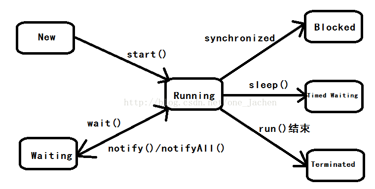

​                                                     (线程状态转换图)

### 纤程

**概念：** 线程中的线程，用户空间的线程，用户态的线程，切换和调度不需要经过OS。

**纤程优势：** 

1.  占有资源少。     OS：纤程1M， Fiber：4k
2. 切换比较简单。
3. 可以启动很多个    10w

**纤程应用场景：** 很短的计算任务，不需要和内核打交道，并发量高。

### 附

分配资源最重要的是有独立的内存空间。

线程调度执行线程共享进程的内存空间，没有自己的内存空间。

在Linux中，线程是一个普通的进程。只不过和其他进程共享资源（内存空间，全局数据）。

1. **start()和run()的区别**

   Start会新开一个线程来执行，而run只是一个普通方法，相当于当前线程来调用，不会启动新线程。

2. **sleep()和wait()的区别**

   ​    Sleep()方法是线程类（Thread）的静态方法，让调用线程进入睡眠状态，让出执行机会给其他线程，等到休眠时间结束后，线程进入就绪状态和其他线程一起竞争cpu的执行时间。

   ​    因为sleep()是static静态方法，他不能改变对象的机锁，当一个synchronized块中调用了sleep()方法，线程虽然进入休眠，但是对象的机锁没有被释放，其他线程依然无法访问这个对象。

   ​    wait()是Object类的方法，当一个线程执行到wait方法时，它就进入到一个和该对象相关的等待池，同时释放对象的机锁，使得其他线程能够访问，可以通过notify，notifyAll方法来唤醒等待的线程。

**线程的生命周期图**

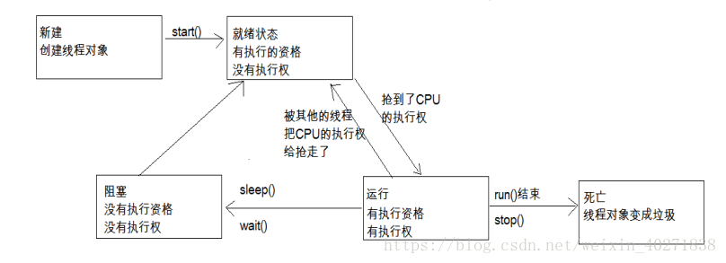


## volatile

### 两个作用

1. 保证线程可见性。
2. 禁止指令重排序
   - DCL单例
   - Double Check Lock
   - Mgr06.java

深入的原理是loadfence CPU原语指令，和storefence原语指令。（读写屏障）

### 线程的可见性

一个线程对共享变量值的修改，能够及时的被其他线程看到。

本质上使用了CPU的缓存一致性协议（MESI）

### 指令重排序

new一个对象的时候分为三步

1. 为对象申请内存。（此时的值为默认值，如int i = 0;）
2. 对象的成员变量初始化。（此时的值为真正的值，如int i = 8;）
3. 把变量指向内存。

如果此时发生指令重排序，步骤3在步骤2之前发生，此时下一个线程进来，会发现对象应该创建完毕，会使用默认的值（int i = 0;）。

volatile不能保证线程的原子性，无法替代synchronized。

## 详解volatile


### 概念 

在多线程并发场景中**volatile**能够保障共享变量的可见性。

那么问题来了，什么是可见性？volatile是怎么保障共享变量的可见性的？

### 线程与线程间的通信

在说可见性之前，我们先来了解在多线程的条件下，线程与线程之间是怎么通信的，如下图。

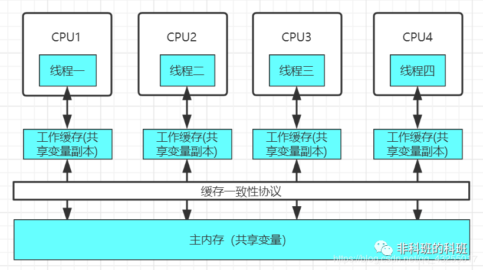

在Java线程中每次的**读取**和**写入**不会直接操作主内存，因为CPU的速度远快于主内存的速度，若是直接操作主内存，大大限制了CPU的性能，对性能有很大的影响，所以每条线程都有各自的**工作内存**。

这里的**工作内存**类似于**缓存**，并非实际存在的，因为缓存的读取和写入速度远大于主内存，这样就大大提高了CPU与**数据交互的性能**。

所有的**共享变量**都是直接存储于**主内存**中，工作内存保存线程在使用主内存共享变量的**副本**，当操作完工作内存的变量，会写入主内存，完成对共享变量的读取和写入。

在单线程时代，不存在数据不一致性的问题，线程都是排队的顺序执行，前面的线程执行完才会到后面的线程执行。

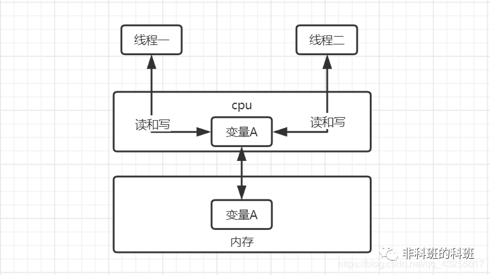

随着计算机的发展，到了**多核多线程**时代，**缓存**的出现虽然提升了CPU的执行效率，但是却出现了**缓存一致性**的问题，为了解决数据的一致性问题，提出两种解决方案：

1. **总线上加Lock锁**：该方法简单粗暴，在总线上加锁，其他CPU的线程只能排队等候，效率低下。
2. **缓存一致性协议**：该方案是JMM提出的解决方案，通过对变量地址加锁，减小锁的粒度，执行变得更加高效。

为了提高程序的执行效率，设计者们提出了底层对编译器和执行器（处理器）的优化方案，分别是**编译器**和**处理器**的**重排序**。

### 编译器和处理器的重排序

**编译器重排序**就是在不改变单线程的语义前提下，可以重新排列语句的执行顺序。

**处理器重排序**是在机器指令层面，假如不存在数据依赖，处理器可以改变机器指令的执行顺序，为了提高程序的执行效率，在多线程中假如两行代码存在数据依赖，将会被禁止重排序。

不管是**编译器重排序**和**处理器重排序**，前提条件都**不能改变单线程语义**的前提下进行重排序，说白了就是最后的**执行结果要准确无误**。

我们的程序用高级语言写完后是不能被各大平台的机器所执行的，需要执行**编译**，然后将编译后的**字节码文件**处理成**机器指令**，才能被计算机执行。

从java源代码到最终的机器执行指令，分别会经过下面三种重排序：

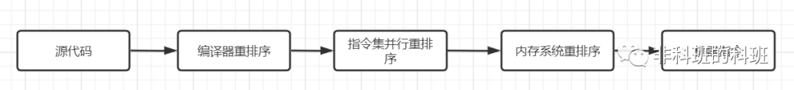

### 什么是数据依赖

数据依赖就是假设一句代码中对一个变量 `a++` 自增，然后后一句代码 `b = a` 将a的值赋值给b，便表示这两句代码存在数据依赖，两局代码执行顺序不能互换。

前面提到编译器和处理器重排序，在编译器和处理器进行重排序的时候，就会遵守数据的依赖性，编译器和处理器就会禁止存在数据依赖的两个操作进行重排序，保证了数据的准确性。

从`JDK5`开始，为了保证程序的有序性，便提出了`happen-before`原则。假如两个操作符合该原则，那么这两个操作可以随意的进行重排序，并不会影响结果的正确性。

### happen-before原则

1. 同一个线程中前面的操作先于后续的操作（但是这个并不是绝对的，假如在单线程的环境下，重排序后不会影响结果的准确性，是可以进行重排序，不按代码的顺序直行）。
2. `Synchronized` 规则中解锁操作先于后续的加锁操作。
3. `volatile` 规则中写操作先于后续的读取操作，保证数据的可见性。
4. 一个线程的`start()`方法先于任何该线程的所有后续操作。
5. 线程的所有操作先于其他该线程在该线程上调用`Join()`返回成功的操作。
6. 如果操作a先于操作b，操作b先于操作c，那么操作a先于操作c，传递性原理。

### volatile关键字

我们来看重点第三条，也就是我们今天所了解的重点volatile关键字，为了实现volatile内存语义，规定有volatile修饰的共享变量在机器指令层面会出现Lock前缀的指令。

我们来看一个经典的例子，具体的代码如下：

```java
public class TestVolatile extends Thread {
    private static boolean flag = false;

    public void run() {
        while (!flag) ;
        System.out.println("run方法退出了")
    }

    public static void main(String[] args) throws Exception {
        new TestVolatile().start();
        Thread.sleep(5000);
        flag = true;
    }
}
```

看上面的代码执行run方法能执行退出吗？是不能的，因为对于这两个线程来说，首先`new TestVolatile().start()`线程拿到`flag`共享变量的值为false，并存储在于自己的工作内存中。

第一个线程到while循环中，就直接进入死循环，即使主线程读取flag的值，然后改变该值为true。

但是对于第一个线程来说并不知道，flag的值已经被修改，在第一个线程的工作内存中flag仍然为false。具体的执行原理图如下：

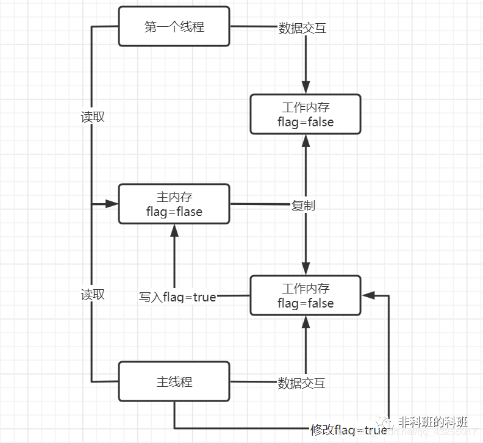

这样对于共享变量flag，主线程修改后，对于线程1来说是不可见的，然后我们加上volatile变量修饰该变量，修改代码如下：

```java
private static volatile boolean flag = false;
```

输出的结果中，就会输出run方法退出了，具体的原理假如一个共享变量被`volatile`修饰，该指令在多核处理器下会引发两件事情。

1. 将当前处理器缓存行数据写回主内存中。
2. 这个写入操作会让其他处理器中已经缓存了该变量的内存地址失效，当其它处理器需求再次使用该变量时，必须从主内存中重新读取该值。

让我们具体从idea的输出的**汇编指令**中可以看出，我们看到红色线框里面的那行指令：`putstatic flag` ，将静态变量`flag`入栈，注意观察add指令前面有一个`lock`前缀指令。

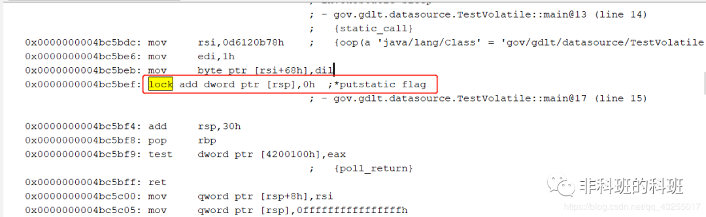

> 注意：让idea输出程序的汇编指令，在启动程序的时候，可以加上
> `-XX:+UnlockDiagnosticVMOptions -XX:+PrintAssembly`作为启动参数，就可以查看汇编指令。

简单的说被volatile修饰的共享变量，在lock指令后是一个原子操作，该原子操作不会被其它线程的调度机制打断，该原子操作一旦执行就会运行到结束，中间不会切换到任意一个线程。

当使用lock前缀的机器指令，它会向cpu发送一个LOCK#信号，这样能保证在多核多线程的情况下互斥的使用该共享变量的内存地址。直到执行完毕，该锁定才会消失。

**volatile的底层**是通过**内存屏障**来实现的，**lock前缀指令**就相当于一个**内存屏障**。

### 内存屏障

内存屏障是一组CPU指令，为了提高程序的运行效率，编译器和处理器运行对指令进行重排序，JMM为了保证程序运行结果的准确性，规定存在**数据依赖**的机器指令**禁止重排序**。

通过插入特定类型的**内存屏障**（例如**lock前缀指令**）来禁止特定类型的编译器重排序和处理器重排序，插入一条内存屏障会告诉编译器和CPU：不管什么指令都不能和这条`Memory Barrier`指令重排序。

所以为了保证每个CPU的数据一致性，每一个CPU会通过嗅探总线上传播的数据来检查自己数据的有效性，当发现自己缓存的数据的内存地址被修改，就会让自己缓存该数据的缓存行失效，重新获取数据，保证了数据的可见性。

那么既然volatile可以保证可见性，它可以保证数据的原子性么？

### 并发编程的三个基本概念

### （1）原子性

定义： 即一个操作或者多个操作 要么全部执行并且执行的过程不会被任何因素打断，要么就都不执行。

原子性是拒绝多线程操作的，不论是多核还是单核，具有原子性的量，同一时刻只能有一个线程来对它进行操作。简而言之，在整个操作过程中不会被线程调度器中断的操作，都可认为是原子性。例如 a=1是原子性操作，但是a++和a +=1就不是原子性操作。

**Java中的原子性操作包括：**

a. 基本类型的读取和赋值操作，且赋值必须是数字赋值给变量，变量之间的相互赋值不是原子性操作。

b.所有引用reference的赋值操作

c.java.concurrent.Atomic.* 包中所有类的一切操作

### （2）可见性

定义：指当多个线程访问同一个变量时，一个线程修改了这个变量的值，其他线程能够立即看得到修改的值。

在多线程环境下，一个线程对共享变量的操作对其他线程是不可见的。Java提供了volatile来保证可见性，当一个变量被volatile修饰后，表示着线程本地内存无效，当一个线程修改共享变量后他会立即被更新到主内存中，其他线程读取共享变量时，会直接从主内存中读取。

当然，synchronize和Lock都可以保证可见性。synchronized和Lock能保证同一时刻只有一个线程获取锁然后执行同步代码，并且在释放锁之前会将对变量的修改刷新到主存当中。因此可以保证可见性。

### （3）有序性

定义：即程序执行的顺序按照代码的先后顺序执行。

Java内存模型中的有序性可以总结为：**如果在本线程内观察，所有操作都是有序的；如果在一个线程中观察另一个线程，所有操作都是无序的。**前半句是指“线程内表现为串行语义”，后半句是指“指令重排序”现象和“工作内存主主内存同步延迟”现象。

在Java内存模型中，为了效率是允许编译器和处理器对指令进行重排序，当然重排序不会影响单线程的运行结果，但是对多线程会有影响。Java提供volatile来保证一定的有序性。最著名的例子就是单例模式里面的DCL（双重检查锁）。

另外，可以通过synchronized和Lock来保证有序性，synchronized和Lock保证每个时刻是有一个线程执行同步代码，相当于是让线程顺序执行同步代码，自然就保证了有序性。

### 缓存一致性协议（MESI）

MESI 协议的核心思想：

- 定义了缓存中的数据状态只有四种，MESI 是四种状态的首字母。
- 当CPU写数据时，如果写的变量是共享变量，即在其他CPU中也存在该变量的副本，会发出信号通知其他CPU将该变量的缓存行置为无效状态；
- 当CPU读取共享变量时，发现自己缓存的该变量的缓存行是无效的，那么它就会从内存中重新读取。

缓存中数据都是以缓存行（Cache Line）为单位存储；MESI 各个状态描述如下表所示：

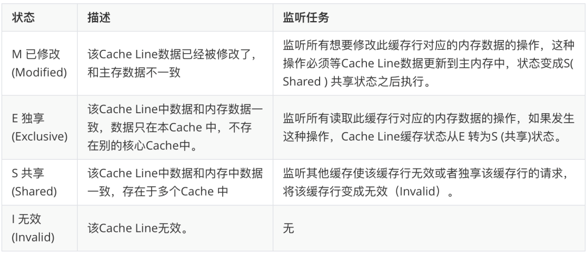

## CAS(无锁优化 自旋 乐观锁)

### 概念

CAS : Compare And Swap/Set

### 实现

CPU原语支持，处理中不能被打断。

 CAS操作中包含三个操作数——需要读写的内存位置（V）、进行比较的预期原值（A）和拟写入的新值（B）。如果内存位置V的值与预期原值A相匹配，那么处理器会自动将该位置值更新为新值B。否则处理器不做任何操作。无论哪种情况，它都会在CAS指令之前返回该位置的值。（在CAS的一些特殊情况下将仅返回CAS是否成功，而不提取当前值。）CAS有效地说明了“我认为位置V应该包含值A；如果包含该值，则将B放到这个位置；否则，不要更改该位置，只告诉我这个位置现在的值即可。”这其实和乐观锁的冲突检查+数据更新的原理是一样的。

cas( Expected, NewValue)

m = 0

m ++

expected = read m

cas(0, 1){

​	for(;;)  

如果当前m值 == 0 则 m =1；break

如果m != 0，则expected = 1, newValue = 2, 再次循环

}

otherwise try again or fail

### ABA问题

如果内存地址V初次读取的值是A，并且在准备赋值的时候检查到它的值仍然是A，那我们就能说它的值没有被其他线程改变过了么？如果在这段期间它的值曾经被改成了B，后来又被改回为A，那CAS操作就会误认为它从来没有被改变过。这个漏洞称为CAS操作的“ABA”问题。AVA并发包为了解决这个问题，提供了一个带有标记的原子引用类“AtomicStampedReference”，它可以通过控制变量值的版本来保证CAS的正确性。因此，在使用CAS前要考虑清楚“ABA”问题是否会影响程序并发的正确性，如果需要解决ABA问题，改用传统的互斥同步可能会比原子类更高效。

### 多线程 int i 自增的几种方式

**Synchronized** 

效率低

**AtomicInteger：**

线程安全，原子操作，不需要加锁

```java
AtomicInteger count = new AtomicInteger(0);

for(int i = 0; i < 10000; i++){
    count.incrementAndGet();//count++
}
```

**LongAdder**

分段锁

LongAdder 在线程数多的时候比AtomicInteger 更有优势。

## AQS

模版设计模式

AQS结构

双向链表（结点为线程），当线程进来，去检查state（volatile）是否为0，如果为0，则抢到锁，并把值赋值成1，（CAS操作）如果不为0，则在在队列中等待抢锁（排队抢锁是公平锁，插队抢锁是非公平锁）,向队列尾巴上加线程的时候用CAS

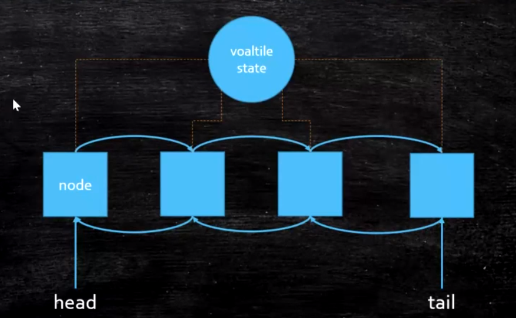

AQS源码

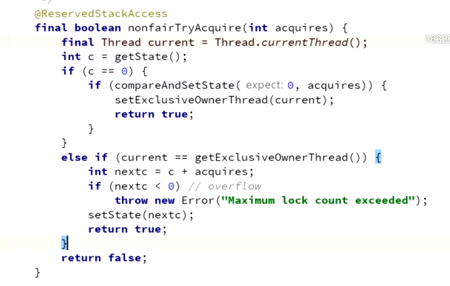

## **VarHandle （JDK1.9以后）**

1、普通属性也可以进行原子性操作

2、比反射快（直接操作2进制码）

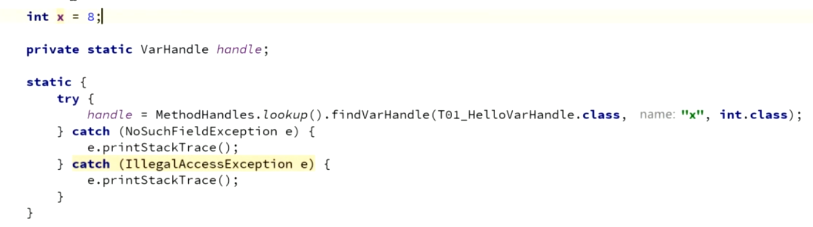

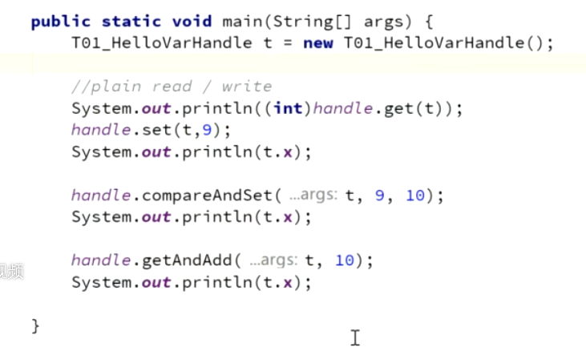

## ThreadLocal


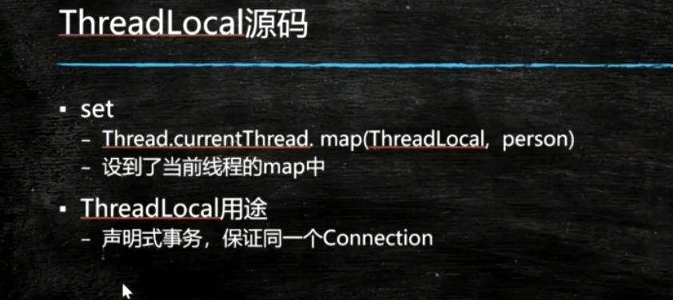

# 强软弱虚四种引用

## 强引用(StrongReference)

### **概念**

**强引用**是使用最普遍的引用。如果一个对象具有强引用，那**垃圾回收器**绝不会回收它。如下：

```java
 Object strongReference = new Object();
```

### **回收机制**

当**内存空间不足**时，`Java`虚拟机宁愿抛出`OutOfMemoryError`错误，使程序**异常终止**，也不会靠随意**回收**具有**强引用**的**对象**来解决内存不足的问题。 
如果强引用对象**不使用时**，需要弱化从而使`GC`能够回收，如下：

```java
 strongReference = null;
```

显式地设置`strongReference`对象为`null`，或让其**超出**对象的**生命周期**范围，则`gc`认为该对象**不存在引用**，这时就可以回收这个对象。具体什么时候收集这要取决于`GC`算法。

```java
 public void test() {
        Object strongReference = new Object();
        // 省略其他操作
    }
```

在一个**方法的内部**有一个**强引用**，这个引用保存在`Java`**栈**中，而真正的引用内容(`Object`)保存在`Java`**堆**中。 

当这个**方法运行完成**后，就会退出**方法栈**，则引用对象的**引用数**为`0`，这个对象会被回收。

但是如果这个`strongReference`是**全局变量**时，就需要在不用这个对象时赋值为`null`，因为**强引用**不会被垃圾回收。

### **ArrayList的Clear方法：**

在`ArrayList`类中定义了一个`elementData`数组，在调用`clear`方法清空数组时，每个数组元素被赋值为`null`。

 不同于`elementData=null`，强引用仍然存在，避免在后续调用`add()`等方法添加元素时进行内存的**重新分配**。 

使用如`clear()`方法**内存数组**中存放的**引用类型**进行**内存释放**特别适用，这样就可以及时释放内存。


## 软引用(SoftReference)

### **回收机制**

如果一个对象只具有**软引用**，则**内存空间充足**时，**垃圾回收器**就**不会**回收它；如果**内存空间不足**了，就会**回收**这些对象的内存。只要垃圾回收器没有回收它，该对象就可以被程序使用。

> 软引用可用来实现内存敏感的高速缓存。

```java
 	// 强引用
    String strongReference = new String("abc");
    // 软引用
    String str = new String("abc");
    SoftReference<String> softReference = new SoftReference<String>(str);
```

**软引用**可以和一个**引用队列**(`ReferenceQueue`)联合使用。如果**软引用**所引用对象被**垃圾回收**，`JAVA`虚拟机就会把这个**软引用**加入到与之关联的**引用队列**中。

```java
	ReferenceQueue<String> referenceQueue = new ReferenceQueue<>();
    String str = new String("abc");
    SoftReference<String> softReference = new SoftReference<>(str, referenceQueue);

    str = null;
    // Notify GC
    System.gc();

    System.out.println(softReference.get()); // abc

    Reference<? extends String> reference = referenceQueue.poll();
    System.out.println(reference); //null
```

> 注意：软引用对象是在jvm内存不够的时候才会被回收，我们调用System.gc()方法只是起通知作用，JVM什么时候扫描回收对象是JVM自己的状态决定的。就算扫描到软引用对象也不一定会回收它，只有内存不够的时候才会回收。

当内存不足时，`JVM`首先将**软引用**中的**对象**引用置为`null`，然后通知**垃圾回收器**进行回收：

```java
	if(JVM内存不足) {
        // 将软引用中的对象引用置为null
        str = null;
        // 通知垃圾回收器进行回收
        System.gc();
    }
```

也就是说，**垃圾收集线程**会在虚拟机抛出`OutOfMemoryError`之前回**收软引用对象**，而且**虚拟机**会尽可能优先回收**长时间闲置不用**的**软引用对象**。对那些**刚构建**的或刚使用过的**“较新的”**软对象会被虚拟机尽可能**保留**，这就是引入**引用队列**`ReferenceQueue`的原因。

### 马士兵

当有一个对象被一个软引用所指向的时候，只有系统内存不够用时，才会被回收。

```java
public class T02_SoftReference {
    public static void main(String[] args) {
        SoftReference<byte[]> m = new SoftReference<>(new byte[1024*1024*10]);
        //m = null;
        System.out.println(m.get());
        System.gc();
        try {
            Thread.sleep(500);
        } catch (InterruptedException e) {
            e.printStackTrace();
        }
        System.out.println(m.get());

        //再分配一个数组，heap将装不下，这时候系统会垃圾回收，先回收一次，如果不够，会把软引用干掉
        byte[] b = new byte[1024*1024*15];
        System.out.println(m.get());
    }
}
```

## 弱引用(WeakReference)

**弱引用**与**软引用**的区别在于：只具有**弱引用**的对象拥有**更短暂**的**生命周期**。在垃圾回收器线程扫描它所管辖的内存区域的过程中，一旦发现了只具有**弱引用**的对象，不管当前**内存空间足够与否**，都会**回收**它的内存。不过，由于垃圾回收器是一个**优先级很低的线程**，因此**不一定**会**很快**发现那些只具有**弱引用**的对象。

```java
	String str = new String("abc");
    WeakReference<String> weakReference = new WeakReference<>(str);
    str = null;
```

`JVM`首先将**软引用**中的**对象**引用置为`null`，然后通知**垃圾回收器**进行回收：

```java
	str = null;
    System.gc();
```

> 注意：如果一个对象是偶尔(很少)的使用，并且希望在使用时随时就能获取到，但又不想影响此对象的垃圾收集，那么你应该用Weak Reference来记住此对象。

下面的代码会让一个**弱引用**再次变为一个**强引用**：

```java
	String str = new String("abc");
    WeakReference<String> weakReference = new WeakReference<>(str);
    // 弱引用转强引用
    String strongReference = weakReference.get();	
```

同样，**弱引用**可以和一个**引用队列**(`ReferenceQueue`)联合使用，如果**弱引用**所引用的**对象**被**垃圾回收**，`Java`虚拟机就会把这个**弱引用**加入到与之关联的**引用队列**中。

`WeakReference`对象的生命周期基本由**垃圾回收器**决定，一旦垃圾回收线程发现了**弱引用对象**，在下一次`GC`过程中就会对其进行回收。

## 虚引用(PhantomReference)

**虚引用**顾名思义，就是**形同虚设**。与其他几种引用都不同，**虚引用**并**不会**决定对象的**生命周期**。如果一个对象**仅持有虚引用**，那么它就和**没有任何引用**一样，在任何时候都可能被垃圾回收器回收。

**虚引用**主要用来**跟踪对象**被垃圾回收器**回收**的活动。 

**虚引用**与**软引用**和**弱引用**的一个区别在于：

> 虚引用必须和引用队列(ReferenceQueue)联合使用。当垃圾回收器准备回收一个对象时，如果发现它还有虚引用，就会在回收对象的内存之前，把这个虚引用加入到与之关联的引用队列中。

```java
 	String str = new String("abc");
    ReferenceQueue queue = new ReferenceQueue();
    // 创建虚引用，要求必须与一个引用队列关联
    PhantomReference pr = new PhantomReference(str, queue);
```

程序可以通过判断引用**队列**中是否已经加入了**虚引用**，来了解被引用的对象是否将要进行**垃圾回收**。如果程序发现某个虚引用已经被加入到引用队列，那么就可以在所引用的对象的**内存被回收之前**采取必要的行动。

## 总结

> Java中4种引用的级别和强度由高到低依次为：强引用 -> 软引用 -> 弱引用 -> 虚引用

当**垃圾回收器**回收时，某些对象会被回收，某些不会被回收。垃圾回收器会从**根对象**`Object`来**标记**存活的对象，然后将某些不可达的对象和一些引用的对象进行回收。

| 引用类型 | 被垃圾回收时间 |        用途        |     生存时间      |
| :------: | :------------: | :----------------: | :---------------: |
|  强引用  |    从来不会    |   对象的一般状态   | JVM停止运行时终止 |
|  软引用  |  当内存不足时  |      对象缓存      |  内存不足时终止   |
|  弱引用  | 正常垃圾回收时 |      对象缓存      |  垃圾回收后终止   |
|  虚引用  | 正常垃圾回收时 | 跟踪对象的垃圾回收 |  垃圾回收后终止   |


# 锁

## 锁的类型

### **可重入锁**

广义上的可重入锁指的是**可重复可递归调用的锁**，在外层使用锁之后，在内层仍然可以使用，并且不发生死锁（前提得是同一个对象或者class），这样的锁就叫做可重入锁、即在执行对象中所有同步方法不用再次获得锁。

**ReentrantLock**和**synchronized**都是可重入锁。举个简单的例子，当一个线程执行到某个synchronized方法时，比如说method1，而在method1中会调用另外一个synchronized方法method2，此时线程**不必重新去申请锁**，而是可以直接执行方法method2。

### **公平锁**

按等待获取锁的线程的**等待时间**进行获取，等待时间长的具有**优先获取锁权利**。非公平锁即无法保证锁的获取是按照请求锁的顺序进行的，这样就可能导致某个或者一些线程永远获取不到锁。

Synchronized是非公平锁，它无法保证等待的线程获取锁的顺序。对于ReentrantLock和ReentrantReadWriteLock，默认情况下是非公平锁，但是可以设置为公平锁。

### **可中断锁**

在等待获取锁过程中**可中断**。Synchronized就是不可中断，而Lock是可中断锁。

### **分段锁**

ConcurrentHashMap使用Segment（分段锁）技术，将数据分成一段一段的存储，然后给**每一段数据配一把锁**，当一个线程占用锁访问其中一个段数据的时候，其他段的数据也是能被其他线程访问，能够实现真正的并发访问。所以说，ConcurrentHashMap在并发情况下，不仅保证了线程安全，而且提高了性能。

### **读写锁**

对资源读取和写入的时候拆分为2部分处理，一个读锁和一个写锁。读的时候可以多线程一起读，写的时候必须同步地写。

ReadWriteLock就是读写锁，它是一个接口，ReentrantReadWriteLock实现了这个接口。可以通过readLock()获取读锁，通过writeLock()获取写锁。

### **乐观锁**

很乐观，每次去拿数据的时候都认为别人不会修改，所以不会上锁，但是在更新的时候会去判断在此期间有没有人去更新这个数据（可以使用版本号等机制）。如果因为冲突失败就重试。乐观锁适用于写比较少的情况下，即冲突比较少发生，这样可以省去了锁的开销，加大了系统的整个吞吐量。

像数据库提供的类似于write_condition机制，其实都是提供的乐观锁。在Java中java.util.concurrent.atomic包下面的原子变量类就是使用了乐观锁的一种实现方式CAS实现的。

### **悲观锁**

总是假设最坏的情况，每次去拿数据的时候都认为别人会修改，因此每次拿数据的时候都会上锁，这样别人想拿这个数据就会阻塞直到它拿到锁，效率比较低。

传统的关系型数据库里面就用到了很多这种锁机制，比如行锁，表锁等，读锁，写锁等，都是在做操作之前先上锁。再比如Java里面的同步原语synchronized关键字的实现也是悲观锁。

### **死锁**

两个进程都在等待对方执行完毕才能继续往下执行的时候就发生了死锁。结果就是两个进程都陷入了无限的等待中。

**产生死锁的四个必要条件：**

**互斥条件：**一个资源每次只能被一个进程使用。

**请求与保持条件：**一个进程因请求资源而阻塞时，对已获得的资源保持不放。

**不剥夺条件**：进程已获得的资源，在未使用完之前，不能强行剥夺。

**循环等待条件：**若干进程之间形成一种头尾相接的循环等待资源关系。

这四个条件是死锁的必要条件，只有系统发生死锁，这些条件必然成立，而只要上述条件之一不满足，就不会发生死锁。

**死锁的解决方法：**

撤销陷于死锁的全部进程；

逐个撤销陷于死锁的进程，直到死锁不存在；

从陷于死锁的进程中逐个强迫放弃所占用的资源，直至死锁消失

从另外一些进程那里强行剥夺足够数量的资源分配给死锁进程，以解除死锁状态

## 常用的锁

### **synchronized**

#### 概念

synchronized可以保证方法或代码块在运行时，同一时刻只有一个线程可以进入到临界区（互斥性），同时它还保证了共享变量的内存可见性。

#### 底层实现

JDK早期的synchronized重量级，都是要去找OS申请锁。造成synchronized效率很低。后来做过改进，有一个锁升级的概念。

**锁升级**：

+ **偏向锁**：第一个访问某把锁的线程，sync (object) ，先在Object的头上面的markword记录这个线程（线程号），没有加锁。如果有线程争用，升级为 **自旋锁**
+ **自旋锁**：默认自旋10次后，如果还得不到这把锁。升级为**重量级锁**
+ **重量级锁**：去OS系统申请资源。

自旋锁占用CPU资源，重量级锁不占用CPU资源，所以执行时间长、线程多重量级锁更好。执行时间短、线程少用自旋锁。

> 《我就是厕所所长》一 二

#### 附

既保证了原子性，又保证了可见性。

锁的是对象而不是代码。

可重入锁

程序在执行过程中，如果出现异常，默认情况锁会被释放

### **ReentrantLock** 

`ReentrantLock可以替代synchronized`

对比synchronized:

1. synchronized是独占锁，加锁和解锁的过程自动进行，易于操作，但不够灵活。ReentrantLock也是独占锁，加锁和解锁的过程需要手动进行，不易操作，但非常灵活。
2. synchronized可重入，因为加锁和解锁自动进行，不必担心最后是否释放锁；ReentrantLock也可重入，但加锁和解锁需要手动进行，且次数需要一样，否则其他线程无法获得锁。
3. synchronized不可响应中断，一个线程获取不到锁就一直等着；ReentrantLock可以响应中断。
4. synchronized是非公平锁，ReentrantLock默认为非公平锁，但是可以设置为公平锁。

### **CountDownLatch**

`*线程中设置信号量-1，一个线程可以多次-1，并设置await地方。当设置好的信号量减到0时，所有线程才会继续向下执行。*`

CountDownLatch是一个同步工具类，用来协调多个线程之间的同步，或者说起到线程之间的通信（而不是用作互斥的作用）。

CountDownLatch能够使一个线程在等待另外一些线程完成各自工作之后，再继续执行。使用一个计数器进行实现。计数器初始值为线程的数量。当每一个线程完成自己任务后，计数器的值就会减一。当计数器的值为0时，表示所有的线程都已经完成一些任务，然后在CountDownLatch上等待的线程就可以恢复执行接下来的任务。

### **CyclicBarrier** 

线程中设置门栓，当没有满足线程数时，线程会在这里等待；直到满足了线程数，所有等待的线程才会继续向下执行。

### ***phaser** 

设置不同的阶段，当线程数满足条件时，线程前往下一个阶段或者取消。

### **ReadWriteLock** 

共享锁（读锁）

排他锁（写锁）

读的时候都可以读，写的时候只能自己写。

### **Semaphore** 

限流

控制最多能有多少个线程同时运行。

可以设置公平锁。

### **StampedLock** //TODO


### ***Exchanger** //TODO

### **LockSupport** //todo

# 异常

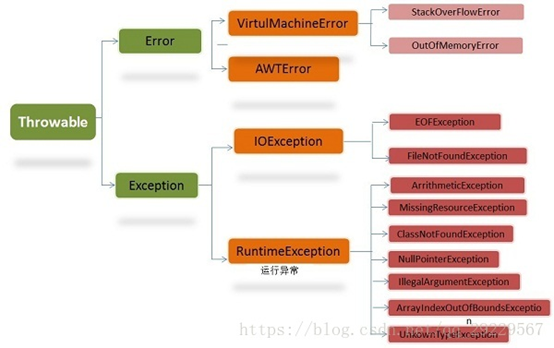

## **Throwable**

**Throwable**有两个重要的子类：**Exception**（异常）和**Error**（错误），二者都是Java异常处理的重要子类，各自都包含大量子类。异常和错误的区别是：异常能被程序本身处理，错误无法处理。

## **Error（错误）**

**Error**是程序无法处理的错误，表示运行应用程序中较严重的问题。大多数错误与代码编写者执行的操作无关，而表示代码运行时JVM（Java虚拟机）出现的问题。例如，Java虚拟机运行错误（Virtual MachineError），当JVM不再有继续执行操作所需的内存资源时，将出现OutOfMemoryError。

这些异常发生时，Java虚拟机（JVM）一般会选择线程终止。这些错误表示故障发生于虚拟机自身、或者发生在虚拟机试图执行应用时，如Java虚拟机运行错误（Virtual MachineError）、类定义错误（NoClassDefFoundError）等。这些错误是不可查的，因为它们在应用程序的控制和处理能力之外，而且绝大多数是程序运行时不允许出现的状况。对于设计合理的应用程序来说，即使确实发生了错误，本质上也不应该试图去处理它所引起的异常状况。在Java中，错误通过Error的子类描述。

## **Exception（异常）**

**Exception**是程序本身可以处理的异常。其中可以分为两大类：

- 运行时异常
- 非运行时异常

### **运行时异常**

RunTimeException类及其子类异常，如NullPointerException（空指针异常）、IndexOutOfBoundsException（下标越界异常）等，这些异常是不检查异常，程序中可以选择捕获处理，也可以不处理。这些异常一般是由程序逻辑错误引起的，程序应该从逻辑角度尽可能避免这类异常的发生。

​    运行时异常的特点是Java编辑器不会检查它，也就是说，当程序中可能出现这类异常，即使没有用try-catch语句捕获它，也没有用throws子句生命抛出它，也会编译通过。

### **非运行时异常（编译异常）**

RuntimeException以外的异常，类型上都属于Exception类及其子类。从程序语法角度讲必须进行处理的异常，如果不处理，程序就不能编译通过。如IOException、SQLException等以及用户自定义的Exception异常，一般情况下不自定义检查异常。

## **异常处理机制**

Java中异常处理机制有，抛出异常、捕获异常。

如果一个方法可能会出现异常，但没有能力处理这种异常，可以在方法声明处用throws或throw来抛出异常。

### **Throws**

throws语句用在方法定义时声明该方法要抛出的异常类型，如果抛出的是Exception异常类型，则该方法被声明为抛出所有的异常。多个异常可使用逗号分割。

格式如下：

```java
public void test() throws Exception,ClassNotFoundException{
    //TODO
}

```

方法名后的Exception1，Exception2…为声明要抛出的异常列表。当方法抛出异常列表的异常时，方法将不对这些类型及其子类类型的异常作处理，而抛向调用该方法的方法，由他去处理。

### **Throw**

throw总是出现在方法体中，用来抛出一个Throwable类或者其子类的实例对象异常。格式如下

```java
throw new IOException();
```

程序会在throw语句后立即终止，它后面的语句执行不到（除了之后的finally），然后在包含它的所有try块中（可能在上层调用函数中）从里向外寻找含有与其匹配的catch子句的try块。

# 匿名类

Java 语音规范上是这么描述匿名类的

匿名类的声明是由Java编译器自动派生自一个类实例创建表达式。

匿名类永远不能是抽象的。

匿名类总是隐式的final。

匿名类总是一个内部类；并且不能是static的。

例子

> 接口中使用"default"关键字，实现接口的时候可以不实现此方法。

```java
public interface TestInterface {
    int getCount();
    String getName();
    default String getOther(){
        return "123";
    }
}
```

```java
TestInterface testInterface = new TestInterface() {
            @Override
            public int getCount() {
                return 0;
            }

            @Override
            public String getName() {
                return null;
            }
        };
        testInterface.getOther();
```

# *Lambda* 表达式

## 创建线程

普通创建线程

```java
new Thread(new Runnable() {
            @Override
            public void run() {
                System.out.println("123");
            }
        }).start();
```

Lambda表达式创建

```java
new Thread(() -> System.out.println("456"),"a1").start();
```

## 遍历集合

普通遍历

```java
for (Book book : bookList) {
            System.out.println(book.getBookName());
            System.out.println(book.getBookId());
        }
```

Lambda表达式遍历

```java
bookList.forEach(book -> System.out.println("book = " + book.getBookName()));
```


