# 虚拟机基础概念

## Java 从编码到执行


## Javac的过程


## 各种虚拟机


## JDK、JRE、JVM的区别联系

马士兵：

JVM与java没有关系，任何语言，只要能编译成class文件，jvm都可以执行。

JVM是一种规范。是虚构出来的一台计算机

- 字节码指令集（汇编语言）
- 内存管理：堆 栈 方法区等


JDK是Java开发工具包，是Sun Microsystems针对Java开发员的产品。

JDK中包含JRE，在JDK的安装目录下有一个名为jre的目录，里面有两个文件夹bin和lib，在这里可以认为bin里的就是jvm，lib中则是jvm工作所需要的类库，而jvm和 lib和起来就称为jre。

JDK是整个JAVA的核心，包括了Java运行环境JRE（Java Runtime Envirnment）、一堆Java工具（javac/java/jdb等）和Java基础的类库（即Java API 包括rt.jar）。


# class文件结构


# 内存加载过程 类加载-初始化（类的生命周期）

​    当我们编写一个java源文件后，经过编译会生成一个后缀名为class的文件，这种文件叫做字节码文件，只有这种字节码文件才能够在java虚拟机中运行，java类的生命周期就是指一个class文件从加载到卸载的全过程。

​    一个java类的完整的生命周期会经历**加载、连接、初始化、使用和卸载**五个阶段，当然也有在加载或者连接之后没有被初始化就直接被使用的情况，如图所示：

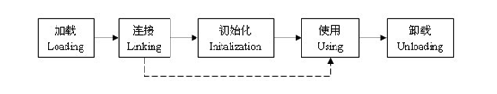

**加载：**在java中，我们经常会接触到一个词---类加载，它和这里的加载并不是一回事，通常我们说类加载指的是类的生命周期中*加载、连接、初始化*三个阶段。在加载阶段，java虚拟机会找到需要加载的类的信息加载到JVM的方法区中，然后在堆区中实例化一个java.lang.class对象，作为方法区中这个类的信息入口。

> ​    类的加载方式比较灵活，我们最常用的加载方式有两种，一种是根据类的全路径名找到相应的class文件，然后从class文件中读取文件内容；另一种是从jar文件中读取。另外，还有下面几种方式比较常用：
>
> 从网络中获取：比如10年前十分流行的Applet。
>
> 根据一定的规则实时生产，比如设计模式中的动态代理模式，就是根据相应的类自动生成它的代理类。
>
> 从非class文件中获取，其实这与直接从class文件中获取的方式本质上是一样的，这些非class文件在jvm中运行之前会被转换为可被jvm所识别的字节码文件。


对于加载的时机，各个虚拟机的做法并不一样，但是有一个原则，就是当jvm“预期”一个类将要被使用时，就会在使用它之前对这个类进行加载。比如说，在一段代码中出现了一个类的名字，jvm在执行这段代码之前并不能确定这个类是否会被使用到，于是，有些jvm会在执行前就加载这个类，而有些则在真正需要用的时候才会去加载它，这取决于具体的jvm实现。我们常用的hotspot虚拟机是采用的后者，就是说当真正用到一个类的时候才对它进行加载。

加载阶段是类的生命周期中的第一个阶段，加载阶段之后，是连接阶段。有一点需要注意，就是有时连接阶段并不会等加载阶段完全完成之后才开始，而是交叉进行，可能一个类只加载了一部分之后，连接阶段就已经开始了。但是这两个阶段总的开始时间和完成时间总是固定的，加载阶段总是在连接阶段之前开始，连接阶段总是在加载阶段完成之后完成。

 

**连接：**连接阶段比较复杂，一般会跟加载阶段和初始化阶段交叉进行，这个阶段的主要任务就是做一些加载后的验证工作以及一些初始化前的准备工作，可以细分为三个步骤：验证、准备和解析。

**1、** **验证：**当一个类被加载之后，必须要验证一下这个类是否合法，比如这个类是不是符合字节码的格式、变量与方法是不是有重复、数据类型是不是有效、继承与实现是否合乎标准等等。总之，这个阶段的目的就是保证加载的类是能够被jvm所运行。

**2、** **准备：**准备阶段的工作就是为类的静态变量分配内存并设为jvm默认的初值，对于非静态的变量，则不会为它们分配内存。有一点需要注意，这时候，静态变量的初值为jvm默认的初值，而不是我们在程序中设定的初值。Jvm默认的初值是这样的。

l 基本类型（int、long、short、char、byte、boolean、float、double）的默认值为0。

l 引用类型的默认值为null。

l 常量的默认值为我们程序中设定的值，比如我们在程序中定义final static int a = 100，则准备阶段中的a的初始值就是100。

**3、** **解析：**这一阶段的任务就是把常量池中的符号引用转换为直接引用。在解析阶段，jvm会将所有的类或接口名、字段名、方法名转换为具体的内存地址。

（那么什么是符号引用，什么又是直接引用呢？我们来举个例子：我们要找一个人，我们现有的信息是这个人的身份证号是1234567890。只有这个信息我们显然找不到这个人，但是通过公安局的身份系统，我们输入1234567890这个号之后，就会得到它的全部信息：比如安徽省黄山市余暇村18号张三，通过这个信息我们就能找到这个人了。这里，123456790就好比是一个符号引用，而安徽省黄山市余暇村18号张三就是直接引用。在内存中也是一样，比如我们要在内存中找一个类里面的一个叫做show的方法，显然是找不到。但是在解析阶段，jvm就会把show这个名字转换为指向方法区的的一块内存地址，比如c17164，通过c17164就可以找到show这个方法具体分配在内存的哪一个区域了。这里show就是符号引用，而c17164就是直接引用。）

**连接阶段完成之后会根据使用的情况（直接引用还是被动引用）来选择是否对类进行初始化。**

**初始化：**如果一个类被直接引用，就会触发类的初始化。在java中，直接引用的情况如下

l 通过new关键字实例化对象、读取或设置类的静态变量、调用类的静态方法。

l 通过反射方式执行以上三种行为。

l 初始化子类的时候，会触发父类的初始化。

l 作为程序入口直接运行时（也就是直接调用main方法）

除了以上四种情况，其他使用类的方式叫做被动引用，而被动引用不会触发类的初始化。

**使用：**类的使用包括主动引用和被动引用，主动引用在初始化时已经说过了，下面说一下被动引用：

l 引用父类的静态字段，只会引起父类的初始化，而不会引起子类的初始化。

l 定义类数组，不会引起类的初始化。

l 引用类的常量，不会引起类的初始化。

最后总结一下使用阶段：**使用阶段包括主动引用和被动引用，主动引用会引起类的初始化，而被动引用不会引起类的初始化**。

当使用阶段完成之后，java类就进入了卸载阶段。

**卸载：**在类使用完之后，如果满足下面的情况，类就会被卸载：

l 该类所有的实例都已经被回收，也就是Java堆中不存在该类的任何实例。

l 加载该类的ClassLoader已经被回收。

l 该类对应的java.lang.Class对象没有任何地方被引用，无法在任何地方通过反射访问该类的方法。

如果以上三个条件全部满足，jvm就会在方法区垃圾回收的时候对类进行卸载，类的卸载过程其实就是在方法区中清空类信息，java类的整个生命周期就结束了。

## 总结：

对象基本上都是在jvm堆区中创建，在创建对象之前，会触发类加载（加载、连接、初始化），当类初始化完成后，根据类信息在堆区中实例化类对象，初始化非静态变量、非静态代码以及默认构造方法，当对象使用完之后会在合适的时候被jvm垃圾收集器回收。读完本文后我们知道，对象的声明周期只是类的声明周期中使用阶段的主动引用的一种情况（即实例化类对象）。而类的整个生命周期则要比对象的生命周期长的多。


## 加载过程

1. Loading : 加载

   1. 双亲委派，主要出于安全考虑

   2. LazyLoading五种情况

   3. ClassLoader的源码 

      ​	findInCache -> parent.loadClass -> findClass()

   4. 自定义类加载器

   5. 混合执行 编译执行 解释执行

2. Linking
   1. Verification ：验证文件是否符合JVM规定
   
   2. Preparation ：静态成员变量赋默认值

   3. Resolution ：将类、方法、属性等符号引用解析为直接引用
   
      ​						常量池中的各种符号引用解析为指针、偏移量等内						存地址的直接引用
   
3. Initializing ：调用类初始化代码 <clinit>，给静态成员变量赋初始值


## loading

### 类加载器

类加载器采用双亲委派机制


## Linking

## lazyloading

- 严格讲应该叫lazyInitializing
- JVM规范并没有规定何时加载
- 但是严格规定了什么时候必须初始化
  - new getstatic putstatic invokestatic 指令，访问final变量除外
  - java.lang.reflect对类进行反射调用时
  - 初始化子类的时候，父类首先初始化
  - 虚拟机启动时，被执行的主类必须初始化
  - 动态语言支持java.lang.invoke.MethodHandle解析的结果为REF_getstatic REF_putstatic REF_invokestatic的方法语柄时，该类必须初始化

### 自定义加载器

1. extends ClassLoader

2. overwrite findClass() -> defineClass(byte[] -> Class clazz)

3. 加密

4. 第一节课遗留问题：parent是如何指定的，打破双亲委派，学生问题桌面图片

5. 用super(parent)指定

6. 双亲委派的打破
   1. 如何打破：重写loadClass（）

   2. 何时打破过？

      1. JDK1.2之前，自定义ClassLoader都必须重写loadClass()

      2. ThreadContextClassLoader可以实现基础类调用实现类代码，通过thread.setContextClassLoader指定

      3. 热启动，热部署

         osgi tomcat 都有自己的模块指定classloader（可以加载同一类库的不同版本）

### 编译

java是一种解释和编译 混合模式的语言


## 内存分配

两种内存分配的方式：

  **指针碰撞：**假设Java堆中的内存是绝对规整的，所有用过的内存都放在一边，空间的内存放在另一边。中间放着一个指针作为分界点的指示器，分配内存就仅仅是把指针往空闲空间那边挪动一段与对象大小相等的近距离。这种方式属于指针碰撞。

  **空闲列表：**如果堆中的内存并不是规整的，已使用的内存和空闲内存相互交错，显然无法使用指针碰撞。虚拟机就必须维护一个列表，记录那些内存是可用的，在分配的时候从列表中找到一块足够大的空间划分给对象实例，并更新记录表上的数据。这种方式属于空闲列表。

具体选择哪种分配方式由Java堆决定，而Java堆是否规整，则由GC收集器决定。因此使用Serial、ParNew等带Compact过程的收集器时，系统采用的分配算法是指针碰撞。而使用CMS这种基于Mark-Sweep算法收集器时，通常采用的空闲列表。

3、如何保证分配内存时线程的安全性

（1）、对分配内存的动作进行同步处理（实际上虚拟机采用CAS配上失败重试的机制保证了更新操作的原子性）

（2）、把分配内存的动作按照线程划分在不同的空间之中进行（即每个线程在Java堆中预先分配一小块内存（称为本地线程分配缓冲））。

## 双亲委派模型

当某个类加载器需要加载某个`.class`文件时，它首先把这个任务委托给他的上级类加载器，递归这个操作，如果上级的类加载器没有加载，自己才会去加载这个类。

**双亲委派机制的作用**

1、防止重复加载同一个`.class`。通过委托去向上面问一问，加载过了，就不用再加载一遍。保证数据安全。
 2、保证核心`.class`不能被篡改。通过委托方式，不会去篡改核心`.clas`，即使篡改也不会去加载，即使加载也不会是同一个`.class`对象了。不同的加载器加载同一个`.class`也不是同一个`Class`对象。这样保证了`Class`执行安全。

## 类加载器的类别 

#### BootstrapClassLoader（启动类加载器）

`c++`编写，加载`java`核心库 `java.*`,构造`ExtClassLoader`和`AppClassLoader`。由于引导类加载器涉及到虚拟机本地实现细节，开发者无法直接获取到启动类加载器的引用，所以不允许直接通过引用进行操作

#### ExtClassLoader （标准扩展类加载器）

`java`编写，加载扩展库，如`classpath`中的`jre` ，`javax.*`或者 `java.ext.dir` 指定位置中的类，开发者可以直接使用标准扩展类加载器。

#### AppClassLoader（系统类加载器）

java编写，加载程序所在的目录，如user.dir所在的位置的class

#### CustomClassLoader（用户自定义类加载器）

`java`编写,用户自定义的类加载器,可加载指定路径的`class`文件

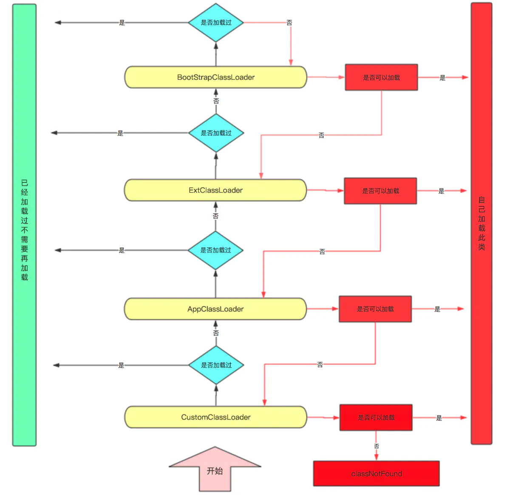

# JAVA 内存模型  

java Memory Model


## 对象的内存布局


1、


2、

### 普通对象

1. 对象头：markword 8
2. ClassPointer指针：-XX:+UseCompressedClassPointers 为4字节 不开启为8字节
3. 实例数据
   1. 引用类型：-XX:+UseCompressedOops 为4字节 不开启为8字节 Oops Ordinary Object Pointers
4. Padding对齐，8的倍数

### 数组对象

1. 对象头：markword 8
2. ClassPointer指针同上
3. 数组长度：4字节
4. 数组数据
5. 对齐 8的倍数

3、

4、

两种方式

句柄池

直接指针（Hospot）

# 硬件层的并发优化基础知识


当两个CPU都把数据Load到自己的高速缓存中去修改时，会产生数据不一致问题


解决数据不一致问题

锁总线（老的CPU使用这种方式）

缓存一致性协议 + 锁总线（新CPU使用）当缓存装不下的时候还是需要总线锁

intel使用MESI 协议


## 缓存行

当我们要把内存里的一些数据放到CPU自己的缓存里时，不会只把这一段数据放进去，而是把临近的数据全部放进缓存中，这些临近的数据叫做Cache line（缓存行），缓存行多数为64字节。

## 伪共享

位于同一缓存行的两个不同数据，被两个不同的CPU锁定，产生互相影响的伪共享问题。

## 缓存行对齐

我们手动的让两个数据位于两个缓存行里，然后两个CPU去修改两个值，那么效率会提高，能解决伪共享问题，但是会浪费一点的空间

## CPU的乱序执行

as if serial : 不管如何重排序，单线程执行结果不会改变

CPU为了提高指令执行效率，会在一条指令执行过程中（比如说去内存读数据（慢100倍）），同时执行另一条指令，前提是，两条指令没有依赖关系


## Volatile 保证不乱序

**使用CPU内存屏障实现（intel x86 CPU 级别）**

sfence: (save) 在sfence指令前的写操作，当必须在sfence指令后的写操作前完成。

lfence: (Load) 在Ifence指令前的读操作，必须在Ifence指令后的读操作前完成。

mfence:在mfence指令前的读写操作，必须在mfence指令后的读写操作前完成。

原子指令，如x86上的”lock …” 指令是一个Full Barrier，执行时会锁住内存子系统来确保执行顺序，甚至跨多个CPU。Software Locks通常使用了内存屏障或原子指令来实现变量可见性和保持程序顺序

**JVM级别如何规范（JVM级别）**

- LoadLoad屏障：
    	对于这样的语句Load1; LoadLoad; Load2， 
      	在Load2及后续读取操作要读取的数据被访问前，保证Load1要读取的数据被读取
- StoreStore屏障：
   	对于这样的语句Store1; StoreStore; Store2，
    	
      	在Store2及后续写入操作执行前，保证Store1的写入操作对其它处理器可见。
- LoadStore屏障：
   	对于这样的语句Load1; LoadStore; Store2，
    	
      	在Store2及后续写入操作被刷出前，保证Load1要读取的数据被读取完毕。
- StoreLoad屏障：
  	对于这样的语句Store1; StoreLoad; Load2，
    	 在Load2及后续所有读取操作执行前，保证Store1的写入对所有处理器可见。


# 缓存一致性协议


# java运行时数据区


## 1、Program Counter 程序计数器（PC）

存放指令位置

虚拟机的运行，类似于这样的循环：

while( not end ) {

​	取PC中的位置，找到对应位置的指令；

​	执行该指令；

​	PC ++;

}

## 2、JVM Stack  JVM栈

自己写的方法，放到这个栈中

1. Frame - 每个线程对应一个栈，每个方法对应一个栈帧，栈帧存储以下四项

   1. Local Variable Table      局部变量

   2. Operand Stack               操作数栈

      对于long的处理（store and load），多数虚拟机的实现都是原子的 jls 17.7，没必要加volatile

   3. Dynamic Linking 

      https://blog.csdn.net/qq_41813060/article/details/88379473 jvms 2.6.3

   4. return address 

      a() -> b()，方法a调用了方法b, b方法的返回值放在什么地方

**入栈出栈详解**

new一个对象的时候

先调用new指令，在堆内存里面新建对象，分配内存，附默认值，并把内存地址入栈

再调用dup指令，在栈顶复制一个地址（此时是对象半初始化状态）

再调用invokespecial指令，把栈顶对象出栈，调用构造方法，对象附初始值

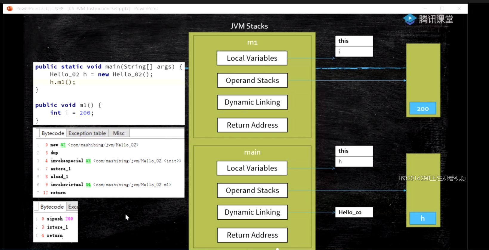

带返回值

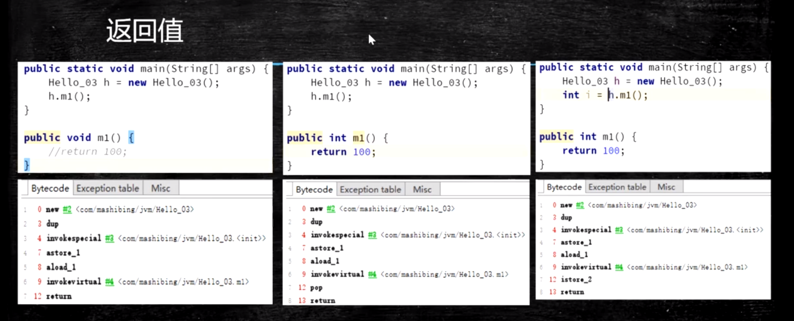

递归（可以看出死递归是不断增加栈，有栈溢出风险）

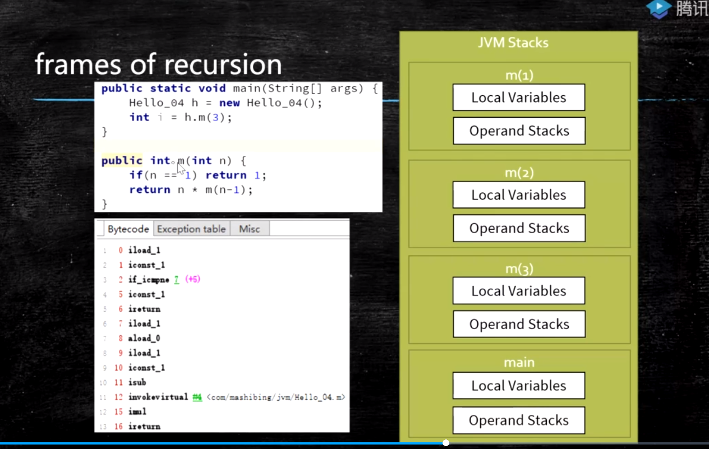


## 3、native method stacks 本地方法栈

java虚拟机内部的 c 和 c++ 写的方法的时候使用这个栈

一般没办法调优

## 4、Heap

## 5、Method Area 方法区

装的是各种各样的class，常量池

1. Perm Space (<1.8) 字符串常量位于PermSpace FGC不会清理 大小启动的时候指定，不能变
2. Meta Space (>=1.8) 字符串常量位于堆 会触发FGC清理 不设定的话，最大就是物理内存

## 6、Direct Memory 直接内存

为了提高效率，1.4版本后，java可以调用操作系统的内存

JVM可以直接访问的内核空间的内存 (OS 管理的内存)

NIO ， 提高效率，实现zero copy

## 7、Runtime Constant Pool 运行时常量池

Class文件中除了有类的版本、字段、方法、接口等描述信息外，还有一项信息是常量池，用于存放编译期生成的各种字面量和符号引用，这部分内容将在类加载后进入方法区的运行时常量池中存放。

## 线程共享区域


# JVM常用指令

store   出栈并赋值

load    入栈

pop     取栈顶元素并出栈

mul

sub

invoke

1. InvokeStatic
2. InvokeVirtual : 自带多肽
3. InvokeInterface : new interface  List<String> list = new ArrayList<>();
4. InovkeSpecial : 可以直接定位，不需要多态的方法 private 方法 ， 构造方法
5. InvokeDynamic : JVM最难的指令 lambda表达式或者反射或者其他动态语言scala kotlin，或者CGLib ASM，动态产生的class，会用到的指令

```java
public static void main(String[] args) {


        I i = C::n;
        I i2 = C::n;
        I i3 = C::n;
        I i4 = () -> {
            C.n();
        };
        System.out.println(i.getClass());
        System.out.println(i2.getClass());
        System.out.println(i3.getClass());

        //for(;;) {I j = C::n;} //MethodArea <1.8 Perm Space (FGC不回收)
    }

    @FunctionalInterface
    public interface I {
        void m();
    }

    public static class C {
        static void n() {
            System.out.println("hello");
        }
    }
```

# GC与调优

熟悉GC常用算法，熟悉常见垃圾收集器，具有实际JVM调优实战经验。

**垃圾：**没有引用指向的任何对象都称之为垃圾

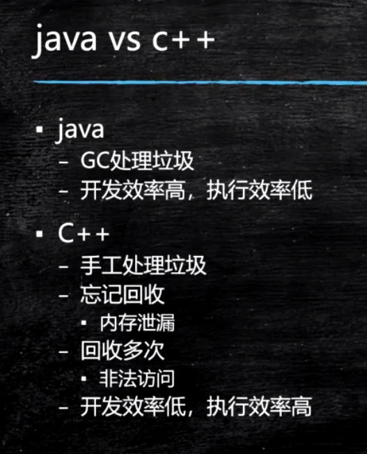

## 基础的两种回收算法

**1、 引用计数算法**

给对象添加一个引用计数器，每当有一个地方引用它时计数器就+1，当引用失效时计数器就-1。只要计数器等于0的对象就是不可能再被使用的。此算法在大部分情况下都是一个不错的选择，也有一些著名的应用案例。但是JAVA虚拟机没有使用。

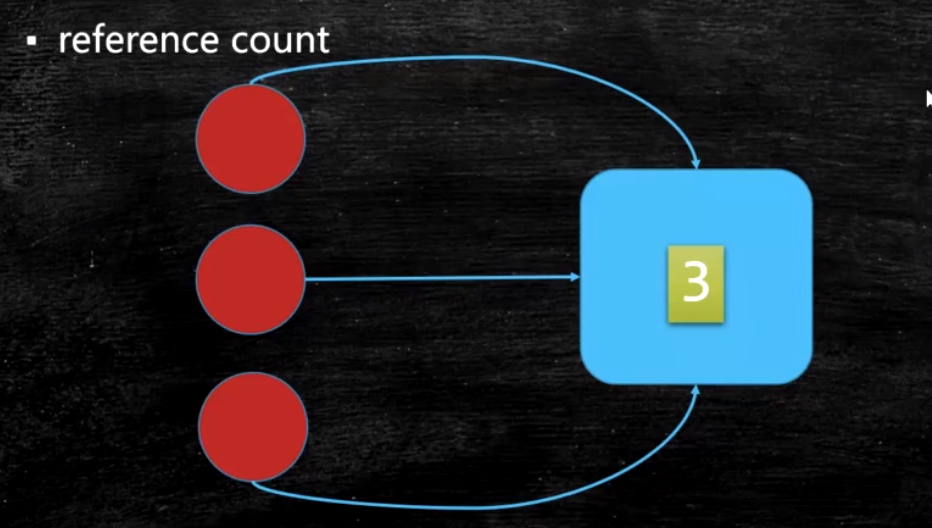

**优点：**实现简单、判断效率高。

**缺点：**很难解决对象之间循环引用的问题。

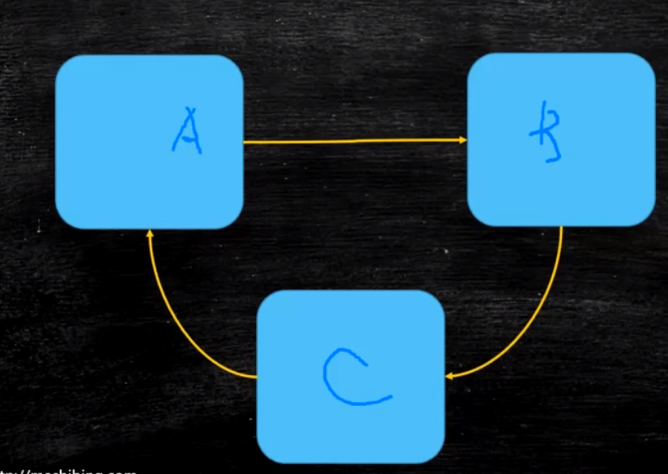


**2、 根可达分析算法。**（Root Searching）

通过一系列的称为“GC Roots”的对象作为起始点，从这些节点开始向下搜索，搜索所走过的路径称为引用链，当一个对象到GC Roots没有使用任何引用链时，则说明该对象是不可用的。

**根对象都有线程栈变量、静态变量、常量池、JNI指针**


**优点：**更加精确和严谨，可以分析出循环数据结构相互引用的情况。

**缺点：**实现比较复杂、需要分析大量数据，消耗大量时间、分析过程需要GC停顿（引用关系不能发生变化），即停顿所有的Java执行线程（称为“Stop the world”，是垃圾回收重点关注的问题）

> 主流的商用程序语言（Java，C#）在主流的实现中，都是通过可达性分析来判定对象是否存活的。


通过下图来清晰的感受gc root与对象展示的联系。所示灰色区域对象是存活的，Object5/6/7均是可回收的对象


## **判断一个对象生存还是死亡**

宣告一个对象死亡，至少要经历两次标记。

**1、 第一次标记**

如果对象进行可达性分析算法之后没发现与GC Roots相连的引用链，那它将会第一次标记并且进行一次筛选。

筛选条件：判断此对象是否有必要执行finalize()方法。

筛选结果：当对象没有覆盖finalize()方法、或者finalize()方法已经被JVM执行过，则判定为可回收对象。如果对象有必要执行finalize()方法，则被放入F-Queue队列中。稍后在JVM自动建立、低优先级的Finalizer线程（可能多个线程）中触发这个方法。

**2、 第二次标记**

GC对F-Queue队列中的对象进行二次标记。

如果对象在finalize()方法中重新与引用链上的任何一个对象建立了关联，那么二次标记时则会将它移除出“即将回收”集合。如果此时对象还没成功逃脱，那么只能被回收了。

**3、 Finalize()方法**

Finalize()是Object类的一个方法、一个对象的finalize()方法只会被系统自动调用一次，经过finalize()方法逃脱死亡的对象，第二次不会再调用。

> 特别说明：并不提倡在程序中调用finalize()来进行自救。建议忘掉Java程序中该方法的存在。因为它执行的时间不确定，甚至是否被执行也不确定（Java程序的不正常退出），而且运行代价高昂，无法保证各个对象的调用顺序（甚至有不同线程中调用）。

## **几种常见的垃圾回收算法**

**1、** **标记-清除算法**（Mark-Sweep 标记清楚）

最基础的收集算法，总共分为“标记”和“清楚”两个阶段

（1）   标记

标记出所有需要回收的对象。

一次标记：在经过可达性分析算法后，对象没有与GC Root相关的引用链，那么则被第一次标记。并且进行一次筛选：当对象有必要执行finalize()方法时，则把该对象放入F-Queue队列中。

二次标记：对F-Queue队列中的对象进行二次标记。在执行finalize()方法时，如果对象重新与GC Root引用链上的任意对象建立了关联，则把他移除“即将回收”集合，否则将被回收、

对于被第一次标记且被第二次标记的，就可以判定为可回收对象了。

（2）   清除

两次标记后，还在“即将回收”集合的对象进行回收。

优点：基础最基础的可达性算法，后续的收集算法都是基于这种思想实现的。

缺点：标记和清楚效率不高，产生大量不连续的内存碎片，导致创建大对象时找不到连续的空间，不得不提前触发另一次的垃圾回收。

**在存活对象比较多的情况下，效率比较高**

**要经过两遍扫描，效率偏低**

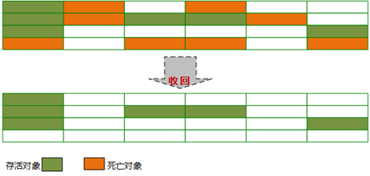

**2、复制算法**（Copying 拷贝）

将可用内存按容量分为大小相等的两块，每次只是用其中一块，当这一块的内存用完了，就将还存活的对象复制到另一块内存上，然后再把已使用的内存空间一次清理掉。

**优点：**实现简单，效率高。解决了标记-清除算法导致的内存碎片问题。（可使用“指针碰撞”的方式分配内存）

**缺点：**代价太大，将内存缩小了一半。（可以改良，不按1：1比例划分）

**效率随对象的存活率升高而降低。**

**需要移动复制对象，调整对象引用，适用于存活对象较少的情况，只扫描一次，效率提高，且没有碎片**

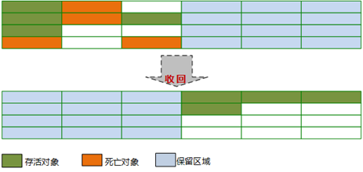

**3、标记整理算法**（Mark-Compact 标记压缩）

标记-整理算法是根据老年代的特点应运而生。

3.1 标记

标记过程和标记-清除算法一致（也是基于可达性分析算法）。

3.2 整理

和标记-清除不同的是，该算法不是针对可回收对象进行清理，而是根据存活对象进行整理。让存活对象都向一端移动，然后直接清理掉边界以外的内存。

优点：不会像复制算法那样随着存活对象的升高而降低效率，不像标记-清楚算法那样产生不连续的内存碎片。

缺点：效率问题，除了像标记-清除算法的标记过程外，还多了一步整理过程，效率更低。

**需要扫描两次，且移动对象，效率更低，不会产生碎片，也不会内存减半**

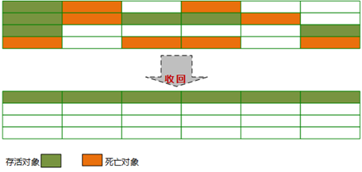

**4、分代收集算法**

当前商业虚拟机的垃圾收集都是采用“分代收集”算法。

根据对象存活周期的不同将内存分为几块。一般把Java堆分为新生代和老年代。JVM根据各个年代的特点采用不同的收集算法。

新生代中，每次进行垃圾回收都会发现大量对象死去，只有少量存活，因此比较适合复制算法。只需要付出少量存活对象的复制成本就可以完成收集。

老年代中，因为对象存活率较高，没有额外的空间进行分配担保，所以适合标记-清除，标记-整理算法进行回收。

## 堆内分区

新生代大量死去，少量存活，采用复制算法

老年代存活率高，回收较少，采用MC或者MS

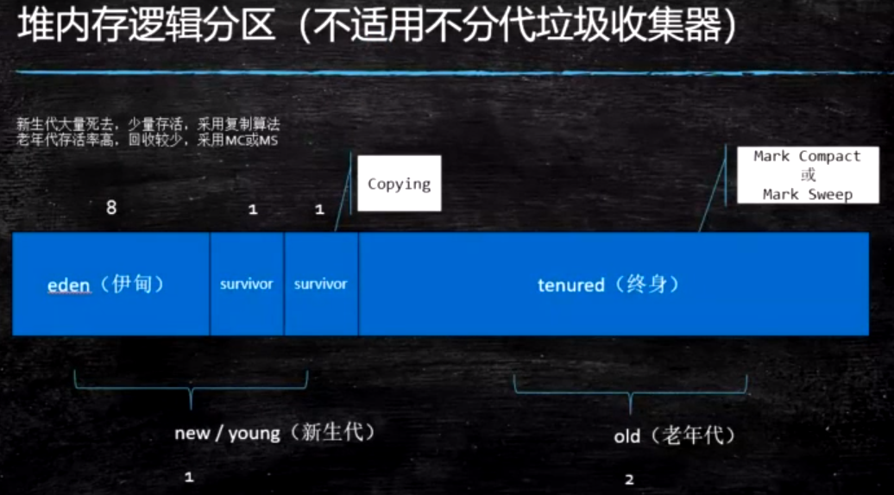

eden（伊甸）：刚刚new出来的对象存放的区域

survivor（幸存者）：回收一次后，对象存放的区域

Old：经过多次回收后，对象存放的区域

## 一个对象的出生到消亡

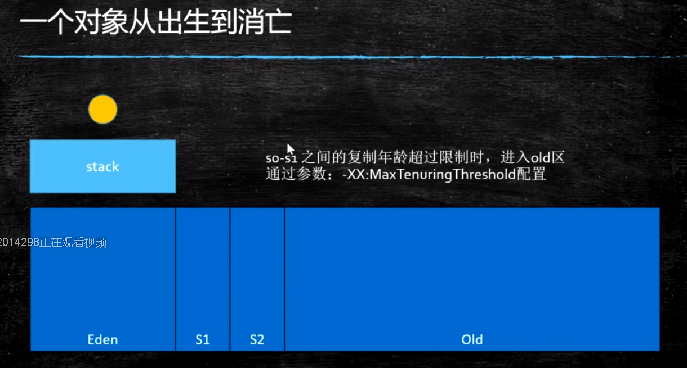

一个对象刚出来尝试放在栈上

栈上放不下，放在eden区

经过回收，放在s1区

经过回收，放在s2区

经过回收，放在s1区

经过回收，放在s2区

...

经过多次回收，放在old区

**对象何时进入老年代**

1. 超过  XX:MaxTenuringThreshold 指定次数（YGC）
2. 默认的 Parallel Scavenge 15次  CMS 6次   G1 15次
3. 动态年龄，从eden区 + s1区复制到s2区的对象超过 s2空间的50%时，直接把年龄最大的放入old区
4. 分配担保：（不重要）
     YGC期间 survivor区空间不够了 空间担保直接进入老年代

## GC概念

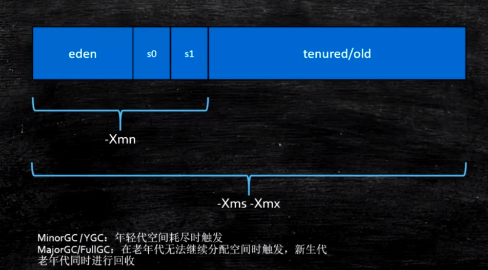

在年轻代触发回收  MinorGC/YGC

Full GC 是清理整个堆空间—包括年轻代和老年代。
Full GC触发条件：
（1）调用System.gc时，系统建议执行Full GC，但是不必然执行
（2）老年代空间不足
（3）方法区空间不足
（4）通过Minor GC后进入老年代的平均大小大于老年代的可用内存
（5）由Eden区、From Space区向To Space区复制时，对象大小大于To Space可用内存，则把该对象转存到老年代，且老年代的可用内存小于该对象大小

## 栈上分配

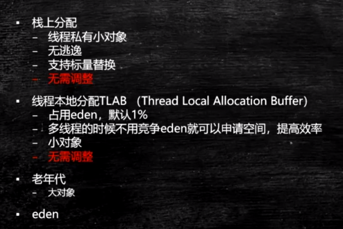

栈上分配的对象，首先是私有的，无逃逸（出了这个方法，没人认识），支持标量替换的

当栈上分配不下，首先会在线程本地分配

**线程本地分配：**当多个线程同时向Eden区分配对象时，会发生线程争用的情况，为了提高效率，会在eden区为每一个线程都分配一个线程独有的区域（占用eden区的1%空间），当线程向eden区分配对象时，会首先向自己独有的区域分配。

**栈上分配的对象，不需要垃圾回收的介入，栈弹出后，对象就没了。**

## 总结

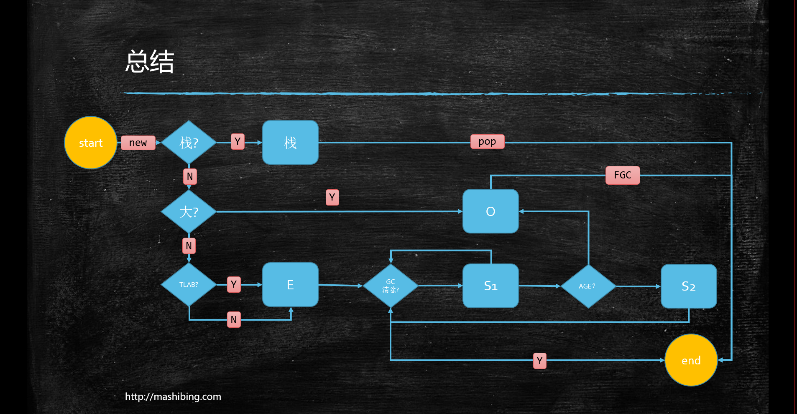

# 常用的垃圾回收器

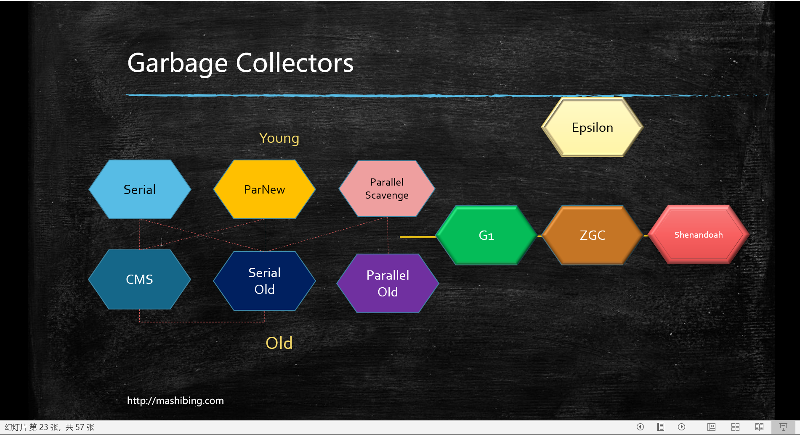

1. JDK诞生 Serial追随 提高效率，诞生了PS，为了配合CMS，诞生了PN，CMS是1.4版本后期引入，CMS是里程碑式的GC，它开启了并发回收的过程，但是CMS毛病较多，因此目前任何一个JDK版本默认是CMS
   并发垃圾回收是因为无法忍受STW
2. Serial 年轻代 串行回收
3. PS 年轻代 并行回收
4. ParNew 年轻代 配合CMS的并行回收
5. SerialOld 
6. ParallelOld
7. ConcurrentMarkSweep 老年代 并发的， 垃圾回收和应用程序同时运行，降低STW的时间(200ms)
   CMS问题比较多，所以现在没有一个版本默认是CMS，只能手工指定
   CMS既然是MarkSweep，就一定会有碎片化的问题，碎片到达一定程度，CMS的老年代分配对象分配不下的时候，使用SerialOld 进行老年代回收
   想象一下：
   PS + PO -> 加内存 换垃圾回收器 -> PN + CMS + SerialOld（几个小时 - 几天的STW）
   几十个G的内存，单线程回收 -> G1 + FGC 几十个G -> 上T内存的服务器 ZGC
   算法：三色标记 + Incremental Update
8. G1(10ms)
   算法：三色标记 + SATB
9. ZGC (1ms) PK C++
   算法：ColoredPointers + LoadBarrier
10. Shenandoah
    算法：ColoredPointers + WriteBarrier
11. Eplison
12. PS 和 PN区别的延伸阅读：
    ▪[https://docs.oracle.com/en/java/javase/13/gctuning/ergonomics.html#GUID-3D0BB91E-9BFF-4EBB-B523-14493A860E73](https://docs.oracle.com/en/java/javase/13/gctuning/ergonomics.html)
13. 垃圾收集器跟内存大小的关系
    1. Serial 几十兆
    2. PS 上百兆 - 几个G
    3. CMS - 20G
    4. G1 - 上百G
    5. ZGC - 4T - 16T（JDK13）

**1.8默认的垃圾回收：PS + ParallelOld**

