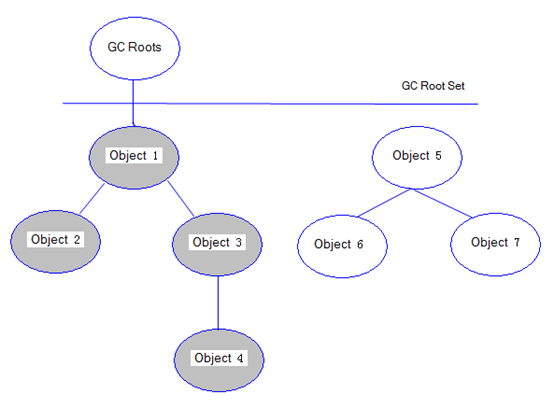
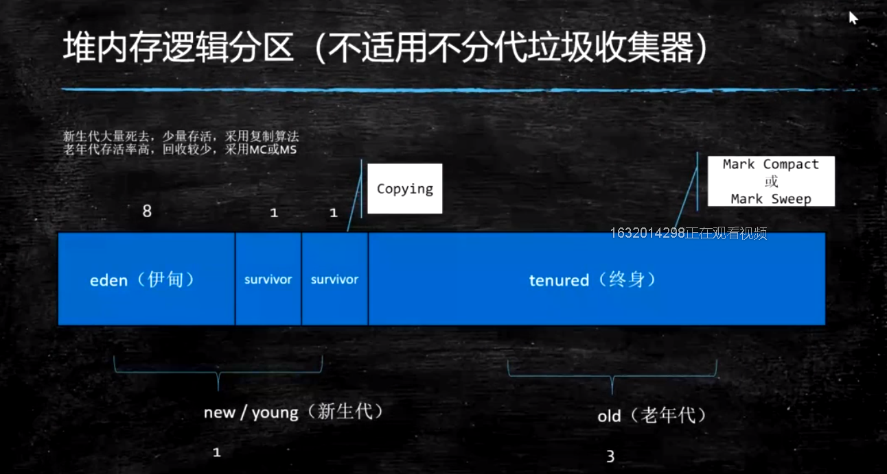

# 虚拟机基础概念

## Java 从编码到执行


## Javac的过程


## 各种虚拟机


## JDK、JRE、JVM的区别联系

马士兵：

JVM与java没有关系，任何语言，只要能编译成class文件，jvm都可以执行。

JVM是一种规范。是虚构出来的一台计算机

- 字节码指令集（汇编语言）
- 内存管理：堆 栈 方法区等


JDK是Java开发工具包，是Sun Microsystems针对Java开发员的产品。

JDK中包含JRE，在JDK的安装目录下有一个名为jre的目录，里面有两个文件夹bin和lib，在这里可以认为bin里的就是jvm，lib中则是jvm工作所需要的类库，而jvm和 lib和起来就称为jre。

JDK是整个JAVA的核心，包括了Java运行环境JRE（Java Runtime Envirnment）、一堆Java工具（javac/java/jdb等）和Java基础的类库（即Java API 包括rt.jar）。


# class文件结构


# 内存加载过程


# 类加载-初始化

## 加载过程

1. Loading : 加载

   1. 双亲委派，主要出于安全考虑

   2. LazyLoading五种情况

   3. ClassLoader的源码 

      ​	findInCache -> parent.loadClass -> findClass()

   4. 自定义类加载器

   5. 混合执行 编译执行 解释执行

2. Linking
   1. Verification ：验证文件是否符合JVM规定
   
   2. Preparation ：静态成员变量赋默认值

   3. Resolution ：将类、方法、属性等符号引用解析为直接引用
   
      ​						常量池中的各种符号引用解析为指针、偏移量等内						存地址的直接引用
   
3. Initializing ：调用类初始化代码 <clinit>，给静态成员变量赋初始值


## loading

### 类加载器

类加载器采用双亲委派机制


### lazyloading

- 严格讲应该叫lazyInitializing
- JVM规范并没有规定何时加载
- 但是严格规定了什么时候必须初始化
  - new getstatic putstatic invokestatic 指令，访问final变量除外
  - java.lang.reflect对类进行反射调用时
  - 初始化子类的时候，父类首先初始化
  - 虚拟机启动时，被执行的主类必须初始化
  - 动态语言支持java.lang.invoke.MethodHandle解析的结果为REF_getstatic REF_putstatic REF_invokestatic的方法语柄时，该类必须初始化

### 自定义加载器

1. extends ClassLoader

2. overwrite findClass() -> defineClass(byte[] -> Class clazz)

3. 加密

4. 第一节课遗留问题：parent是如何指定的，打破双亲委派，学生问题桌面图片

5. 用super(parent)指定

6. 双亲委派的打破
   1. 如何打破：重写loadClass（）

   2. 何时打破过？

      1. JDK1.2之前，自定义ClassLoader都必须重写loadClass()

      2. ThreadContextClassLoader可以实现基础类调用实现类代码，通过thread.setContextClassLoader指定

      3. 热启动，热部署

         osgi tomcat 都有自己的模块指定classloader（可以加载同一类库的不同版本）

### 编译

java是一种解释和编译 混合模式的语言


## Linking


# JAVA 内存模型  

java Memory Model


## 对象的内存布局


1、


2、

### 普通对象

1. 对象头：markword 8
2. ClassPointer指针：-XX:+UseCompressedClassPointers 为4字节 不开启为8字节
3. 实例数据
   1. 引用类型：-XX:+UseCompressedOops 为4字节 不开启为8字节 Oops Ordinary Object Pointers
4. Padding对齐，8的倍数

### 数组对象

1. 对象头：markword 8
2. ClassPointer指针同上
3. 数组长度：4字节
4. 数组数据
5. 对齐 8的倍数

3、

4、

两种方式

句柄池

直接指针（Hospot）

# 硬件层的并发优化基础知识


当两个CPU都把数据Load到自己的高速缓存中去修改时，会产生数据不一致问题


解决数据不一致问题

锁总线（老的CPU使用这种方式）

缓存一致性协议 + 锁总线（新CPU使用）当缓存装不下的时候还是需要总线锁

intel使用MESI 协议


## 缓存行

当我们要把内存里的一些数据放到CPU自己的缓存里时，不会只把这一段数据放进去，而是把临近的数据全部放进缓存中，这些临近的数据叫做Cache line（缓存行），缓存行多数为64字节。

## 伪共享

位于同一缓存行的两个不同数据，被两个不同的CPU锁定，产生互相影响的伪共享问题。

## 缓存行对齐

我们手动的让两个数据位于两个缓存行里，然后两个CPU去修改两个值，那么效率会提高，能解决伪共享问题，但是会浪费一点的空间

## CPU的乱序执行

as if serial : 不管如何重排序，单线程执行结果不会改变

CPU为了提高指令执行效率，会在一条指令执行过程中（比如说去内存读数据（慢100倍）），同时执行另一条指令，前提是，两条指令没有依赖关系


## Volatile 保证不乱序

**使用CPU内存屏障实现（intel x86 CPU 级别）**

sfence: (save) 在sfence指令前的写操作，当必须在sfence指令后的写操作前完成。

lfence: (Load) 在Ifence指令前的读操作，必须在Ifence指令后的读操作前完成。

mfence:在mfence指令前的读写操作，必须在mfence指令后的读写操作前完成。

原子指令，如x86上的”lock …” 指令是一个Full Barrier，执行时会锁住内存子系统来确保执行顺序，甚至跨多个CPU。Software Locks通常使用了内存屏障或原子指令来实现变量可见性和保持程序顺序

**JVM级别如何规范（JVM级别）**

- LoadLoad屏障：
    	对于这样的语句Load1; LoadLoad; Load2， 
      	在Load2及后续读取操作要读取的数据被访问前，保证Load1要读取的数据被读取
- StoreStore屏障：
   	对于这样的语句Store1; StoreStore; Store2，
    	
      	在Store2及后续写入操作执行前，保证Store1的写入操作对其它处理器可见。
- LoadStore屏障：
   	对于这样的语句Load1; LoadStore; Store2，
    	
      	在Store2及后续写入操作被刷出前，保证Load1要读取的数据被读取完毕。
- StoreLoad屏障：
  	对于这样的语句Store1; StoreLoad; Load2，
    	 在Load2及后续所有读取操作执行前，保证Store1的写入对所有处理器可见。


# 缓存一致性协议


# java运行时数据区


## 1、Program Counter 程序计数器（PC）

存放指令位置

虚拟机的运行，类似于这样的循环：

while( not end ) {

​	取PC中的位置，找到对应位置的指令；

​	执行该指令；

​	PC ++;

}

## 2、JVM Stack  JVM栈

自己写的方法，放到这个栈中

1. Frame - 每个线程对应一个栈，每个方法对应一个栈帧，栈帧存储以下四项

   1. Local Variable Table      局部变量

   2. Operand Stack               操作数栈

      对于long的处理（store and load），多数虚拟机的实现都是原子的 jls 17.7，没必要加volatile

   3. Dynamic Linking 

      https://blog.csdn.net/qq_41813060/article/details/88379473 jvms 2.6.3

   4. return address 

      a() -> b()，方法a调用了方法b, b方法的返回值放在什么地方

**入栈出栈详解**

new一个对象的时候

先调用new指令，在堆内存里面新建对象，分配内存，附默认值，并把内存地址入栈

再调用dup指令，在栈顶复制一个地址（此时是对象半初始化状态）

再调用invokespecial指令，把栈顶对象出栈，调用构造方法，对象附初始值


带返回值


递归（可以看出死递归是不断增加栈，有栈溢出风险）


## 3、native method stacks 本地方法栈

java虚拟机内部的 c 和 c++ 写的方法的时候使用这个栈

一般没办法调优

## 4、Heap

## 5、Method Area 方法区

装的是各种各样的class，常量池

1. Perm Space (<1.8) 字符串常量位于PermSpace FGC不会清理 大小启动的时候指定，不能变
2. Meta Space (>=1.8) 字符串常量位于堆 会触发FGC清理 不设定的话，最大就是物理内存

## 6、Direct Memory 直接内存

为了提高效率，1.4版本后，java可以调用操作系统的内存

JVM可以直接访问的内核空间的内存 (OS 管理的内存)

NIO ， 提高效率，实现zero copy

## 7、Runtime Constant Pool 运行时常量池

Class文件中除了有类的版本、字段、方法、接口等描述信息外，还有一项信息是常量池，用于存放编译期生成的各种字面量和符号引用，这部分内容将在类加载后进入方法区的运行时常量池中存放。

## 线程共享区域


# JVM常用指令

store   出栈并赋值

load    入栈

pop     取栈顶元素并出栈

mul

sub

invoke

1. InvokeStatic
2. InvokeVirtual : 自带多肽
3. InvokeInterface : new interface  List<String> list = new ArrayList<>();
4. InovkeSpecial : 可以直接定位，不需要多态的方法 private 方法 ， 构造方法
5. InvokeDynamic : JVM最难的指令 lambda表达式或者反射或者其他动态语言scala kotlin，或者CGLib ASM，动态产生的class，会用到的指令

```java
public static void main(String[] args) {


        I i = C::n;
        I i2 = C::n;
        I i3 = C::n;
        I i4 = () -> {
            C.n();
        };
        System.out.println(i.getClass());
        System.out.println(i2.getClass());
        System.out.println(i3.getClass());

        //for(;;) {I j = C::n;} //MethodArea <1.8 Perm Space (FGC不回收)
    }

    @FunctionalInterface
    public interface I {
        void m();
    }

    public static class C {
        static void n() {
            System.out.println("hello");
        }
    }
```

# GC与调优

熟悉GC常用算法，熟悉常见垃圾收集器，具有实际JVM调优实战经验。

**垃圾：**没有引用指向的任何对象都称之为垃圾


## 基础的两种回收算法

**1、 引用计数算法**

给对象添加一个引用计数器，每当有一个地方引用它时计数器就+1，当引用失效时计数器就-1。只要计数器等于0的对象就是不可能再被使用的。此算法在大部分情况下都是一个不错的选择，也有一些著名的应用案例。但是JAVA虚拟机没有使用。


**优点：**实现简单、判断效率高。

**缺点：**很难解决对象之间循环引用的问题。


**2、 根可达分析算法。**（Root Searching）

通过一系列的称为“GC Roots”的对象作为起始点，从这些节点开始向下搜索，搜索所走过的路径称为引用链，当一个对象到GC Roots没有使用任何引用链时，则说明该对象是不可用的。

### 根对象都有线程栈变量、静态变量、常量池、JNI指针


**优点：**更加精确和严谨，可以分析出循环数据结构相互引用的情况。

**缺点：**实现比较复杂、需要分析大量数据，消耗大量时间、分析过程需要GC停顿（引用关系不能发生变化），即停顿所有的Java执行线程（称为“Stop the world”，是垃圾回收重点关注的问题）

> 主流的商用程序语言（Java，C#）在主流的实现中，都是通过可达性分析来判定对象是否存活的。


通过下图来清晰的感受gc root与对象展示的联系。所示灰色区域对象是存活的，Object5/6/7均是可回收的对象



## **判断一个对象生存还是死亡**

宣告一个对象死亡，至少要经历两次标记。

**1、 第一次标记**

如果对象进行可达性分析算法之后没发现与GC Roots相连的引用链，那它将会第一次标记并且进行一次筛选。

筛选条件：判断此对象是否有必要执行finalize()方法。

筛选结果：当对象没有覆盖finalize()方法、或者finalize()方法已经被JVM执行过，则判定为可回收对象。如果对象有必要执行finalize()方法，则被放入F-Queue队列中。稍后在JVM自动建立、低优先级的Finalizer线程（可能多个线程）中触发这个方法。

**2、 第二次标记**

GC对F-Queue队列中的对象进行二次标记。

如果对象在finalize()方法中重新与引用链上的任何一个对象建立了关联，那么二次标记时则会将它移除出“即将回收”集合。如果此时对象还没成功逃脱，那么只能被回收了。

**3、 Finalize()方法**

Finalize()是Object类的一个方法、一个对象的finalize()方法只会被系统自动调用一次，经过finalize()方法逃脱死亡的对象，第二次不会再调用。

> 特别说明：并不提倡在程序中调用finalize()来进行自救。建议忘掉Java程序中该方法的存在。因为它执行的时间不确定，甚至是否被执行也不确定（Java程序的不正常退出），而且运行代价高昂，无法保证各个对象的调用顺序（甚至有不同线程中调用）。

## **几种常见的垃圾回收算法**

**1、** **标记-清除算法**（Mark-Sweep 标记清楚）

最基础的收集算法，总共分为“标记”和“清楚”两个阶段

（1）   标记

标记出所有需要回收的对象。

一次标记：在经过可达性分析算法后，对象没有与GC Root相关的引用链，那么则被第一次标记。并且进行一次筛选：当对象有必要执行finalize()方法时，则把该对象放入F-Queue队列中。

二次标记：对F-Queue队列中的对象进行二次标记。在执行finalize()方法时，如果对象重新与GC Root引用链上的任意对象建立了关联，则把他移除“即将回收”集合，否则将被回收、

对于被第一次标记且被第二次标记的，就可以判定为可回收对象了。

（2）   清除

两次标记后，还在“即将回收”集合的对象进行回收。

优点：基础最基础的可达性算法，后续的收集算法都是基于这种思想实现的。

缺点：标记和清楚效率不高，产生大量不连续的内存碎片，导致创建大对象时找不到连续的空间，不得不提前触发另一次的垃圾回收。

**在存活对象比较多的情况下，效率比较高**

**要经过两遍扫描，效率偏低**


**2、复制算法**（Copying 拷贝）

将可用内存按容量分为大小相等的两块，每次只是用其中一块，当这一块的内存用完了，就将还存活的对象复制到另一块内存上，然后再把已使用的内存空间一次清理掉。

**优点：**实现简单，效率高。解决了标记-清除算法导致的内存碎片问题。（可使用“指针碰撞”的方式分配内存）

**缺点：**代价太大，将内存缩小了一半。（可以改良，不按1：1比例划分）

**效率随对象的存活率升高而降低。**

**需要移动复制对象，调整对象引用，适用于存活对象较少的情况，只扫描一次，效率提高，且没有碎片**


**3、标记整理算法**（Mark-Compact 标记压缩）

标记-整理算法是根据老年代的特点应运而生。

3.1 标记

标记过程和标记-清除算法一致（也是基于可达性分析算法）。

3.2 整理

和标记-清除不同的是，该算法不是针对可回收对象进行清理，而是根据存活对象进行整理。让存活对象都向一端移动，然后直接清理掉边界以外的内存。

优点：不会像复制算法那样随着存活对象的升高而降低效率，不像标记-清楚算法那样产生不连续的内存碎片。

缺点：效率问题，除了像标记-清除算法的标记过程外，还多了一步整理过程，效率更低。

**需要扫描两次，且移动对象，效率更低，不会产生碎片，也不会内存减半**


**4、分代收集算法**

当前商业虚拟机的垃圾收集都是采用“分代收集”算法。

根据对象存活周期的不同将内存分为几块。一般把Java堆分为新生代和老年代。JVM根据各个年代的特点采用不同的收集算法。

新生代中，每次进行垃圾回收都会发现大量对象死去，只有少量存活，因此比较适合复制算法。只需要付出少量存活对象的复制成本就可以完成收集。

老年代中，因为对象存活率较高，没有额外的空间进行分配担保，所以适合标记-清除，标记-整理算法进行回收。

## 堆内分区

新生代大量死去，少量存活，采用复制算法

老年代存活率高，回收较少，采用MC或者MS



eden（伊甸）：刚刚new出来的对象存放的区域

survivor（幸存者）：回收一次后，对象存放的区域

Old：经过多次回收后，对象存放的区域

## 一个对象的出生到消亡


一个对象刚出来尝试放在栈上

栈上放不下，放在eden区

经过回收，放在s1区

经过回收，放在s2区

经过回收，放在s1区

经过回收，放在s2区

...

经过多次回收，放在old区

## GC概念


在年轻代触发回收  MinorGC/YGC

在老年代触发回收  MajorGC/FullGC

## 栈上分配


栈上分配的对象，首先是私有的，无逃逸（出了这个方法，没人认识），支持标量替换的

当栈上分配不下，首先会在线程本地分配

**线程本地分配：**当多个线程同时向Eden区分配对象时，会发生线程争用的情况，为了提高效率，会在eden区为每一个线程都分配一个线程独有的区域（占用eden区的1%空间），当线程向eden区分配对象时，会首先向自己独有的区域分配。


