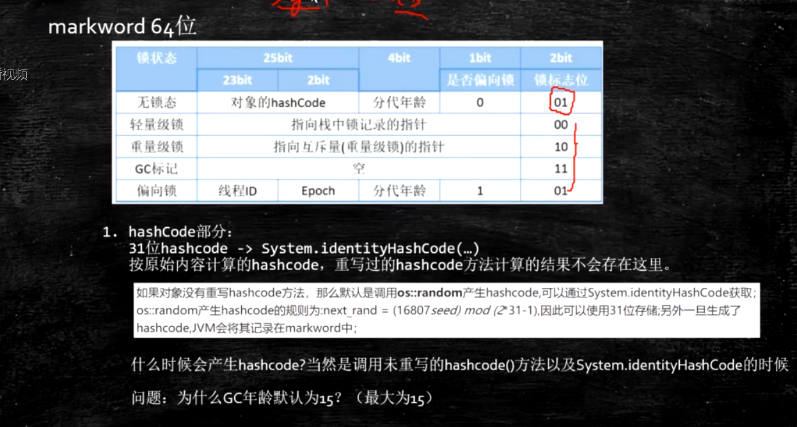
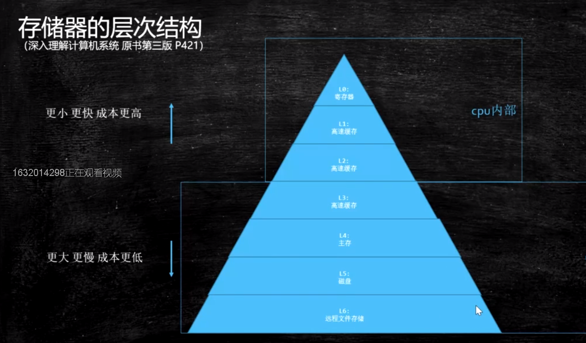

# 虚拟机基础概念

## Java 从编码到执行

## Javac的过程

## 各种虚拟机

## JDK、JRE、JVM的区别联系

马士兵：

JVM与java没有关系，任何语言，只要能编译成class文件，jvm都可以执行。

JVM是一种规范。是虚构出来的一台计算机

- 字节码指令集（汇编语言）
- 内存管理：堆 栈 方法区等

JDK是Java开发工具包，是Sun Microsystems针对Java开发员的产品。

JDK中包含JRE，在JDK的安装目录下有一个名为jre的目录，里面有两个文件夹bin和lib，在这里可以认为bin里的就是jvm，lib中则是jvm工作所需要的类库，而jvm和 lib和起来就称为jre。

JDK是整个JAVA的核心，包括了Java运行环境JRE（Java Runtime Envirnment）、一堆Java工具（javac/java/jdb等）和Java基础的类库（即Java API 包括rt.jar）。

# class文件结构

# 内存加载过程

# 类加载-初始化

## 加载过程

1. Loading : 加载

   1. 双亲委派，主要出于安全考虑

   2. LazyLoading五种情况

   3. ClassLoader的源码 

      ​	findInCache -> parent.loadClass -> findClass()

   4. 自定义类加载器

   5. 混合执行 编译执行 解释执行

2. Linking
   1. Verification ：验证文件是否符合JVM规定
   
   2. Preparation ：静态成员变量赋默认值

   3. Resolution ：将类、方法、属性等符号引用解析为直接引用
   
      ​						常量池中的各种符号引用解析为指针、偏移量等内						存地址的直接引用
   
3. Initializing ：调用类初始化代码 <clinit>，给静态成员变量赋初始值

## loading

### 类加载器

类加载器采用双亲委派机制

### lazyloading

- 严格讲应该叫lazyInitializing
- JVM规范并没有规定何时加载
- 但是严格规定了什么时候必须初始化
  - new getstatic putstatic invokestatic 指令，访问final变量除外
  - java.lang.reflect对类进行反射调用时
  - 初始化子类的时候，父类首先初始化
  - 虚拟机启动时，被执行的主类必须初始化
  - 动态语言支持java.lang.invoke.MethodHandle解析的结果为REF_getstatic REF_putstatic REF_invokestatic的方法语柄时，该类必须初始化

### 自定义加载器

1. extends ClassLoader

2. overwrite findClass() -> defineClass(byte[] -> Class clazz)

3. 加密

4. 第一节课遗留问题：parent是如何指定的，打破双亲委派，学生问题桌面图片

5. 用super(parent)指定

6. 双亲委派的打破
   1. 如何打破：重写loadClass（）

   2. 何时打破过？

      1. JDK1.2之前，自定义ClassLoader都必须重写loadClass()

      2. ThreadContextClassLoader可以实现基础类调用实现类代码，通过thread.setContextClassLoader指定

      3. 热启动，热部署

         osgi tomcat 都有自己的模块指定classloader（可以加载同一类库的不同版本）

### 编译

java是一种解释和编译 混合模式的语言

## Linking

# JAVA 内存模型  

java Memory Model

## 对象的内存布局

1、

2、

### 普通对象

1. 对象头：markword 8
2. ClassPointer指针：-XX:+UseCompressedClassPointers 为4字节 不开启为8字节
3. 实例数据
   1. 引用类型：-XX:+UseCompressedOops 为4字节 不开启为8字节 Oops Ordinary Object Pointers
4. Padding对齐，8的倍数

### 数组对象

1. 对象头：markword 8
2. ClassPointer指针同上
3. 数组长度：4字节
4. 数组数据
5. 对齐 8的倍数

3、

4、

两种方式

句柄池

直接指针（Hospot）

# 硬件层的并发优化基础知识

当两个CPU都把数据Load到自己的高速缓存中去修改时，会产生数据不一致问题

解决数据不一致问题

锁总线（老的CPU使用这种方式）

缓存一致性协议 + 锁总线（新CPU使用）当缓存装不下的时候还是需要总线锁

intel使用MESI 协议

## 缓存行

当我们要把内存里的一些数据放到CPU自己的缓存里时，不会只把这一段数据放进去，而是把临近的数据全部放进缓存中，这些临近的数据叫做Cache line（缓存行），缓存行多数为64字节。

## 伪共享

位于同一缓存行的两个不同数据，被两个不同的CPU锁定，产生互相影响的伪共享问题。

## 缓存行对齐

我们手动的让两个数据位于两个缓存行里，然后两个CPU去修改两个值，那么效率会提高，能解决伪共享问题，但是会浪费一点的空间

## CPU的乱序执行

as if serial : 不管如何重排序，单线程执行结果不会改变

CPU为了提高指令执行效率，会在一条指令执行过程中（比如说去内存读数据（慢100倍）），同时执行另一条指令，前提是，两条指令没有依赖关系

## Volatile 保证不乱序

**使用CPU内存屏障实现（intel x86 CPU 级别）**

sfence: (save) 在sfence指令前的写操作，当必须在sfence指令后的写操作前完成。

lfence: (Load) 在Ifence指令前的读操作，必须在Ifence指令后的读操作前完成。

mfence:在mfence指令前的读写操作，必须在mfence指令后的读写操作前完成。

原子指令，如x86上的”lock …” 指令是一个Full Barrier，执行时会锁住内存子系统来确保执行顺序，甚至跨多个CPU。Software Locks通常使用了内存屏障或原子指令来实现变量可见性和保持程序顺序

**JVM级别如何规范（JVM级别）**

- LoadLoad屏障：
    	对于这样的语句Load1; LoadLoad; Load2， 
      	在Load2及后续读取操作要读取的数据被访问前，保证Load1要读取的数据被读取
- StoreStore屏障：
   	对于这样的语句Store1; StoreStore; Store2，
    	
      	在Store2及后续写入操作执行前，保证Store1的写入操作对其它处理器可见。
- LoadStore屏障：
   	对于这样的语句Load1; LoadStore; Store2，
    	
      	在Store2及后续写入操作被刷出前，保证Load1要读取的数据被读取完毕。
- StoreLoad屏障：
  	对于这样的语句Store1; StoreLoad; Load2，
    	 在Load2及后续所有读取操作执行前，保证Store1的写入对所有处理器可见。

# 缓存一致性协议

# java运行时数据区

## 1、Program Counter 程序计数器（PC）

存放指令位置

虚拟机的运行，类似于这样的循环：

while( not end ) {

​	取PC中的位置，找到对应位置的指令；

​	执行该指令；

​	PC ++;

}

## 2、JVM Stack  JVM栈

自己写的方法，放到这个栈中

1. Frame - 每个线程对应一个栈，每个方法对应一个栈帧，栈帧存储以下四项

   1. Local Variable Table      局部变量

   2. Operand Stack               操作数栈

      对于long的处理（store and load），多数虚拟机的实现都是原子的 jls 17.7，没必要加volatile

   3. Dynamic Linking 

      https://blog.csdn.net/qq_41813060/article/details/88379473 jvms 2.6.3

   4. return address 

      a() -> b()，方法a调用了方法b, b方法的返回值放在什么地方

## 3、native method stacks 本地方法栈

java虚拟机内部的 c 和 c++ 写的方法的时候使用这个栈

一般没办法调优

## 4、Heap

## 5、Method Area 方法区

装的是各种各样的class，常量池

1. Perm Space (<1.8) 字符串常量位于PermSpace FGC不会清理 大小启动的时候指定，不能变
2. Meta Space (>=1.8) 字符串常量位于堆 会触发FGC清理 不设定的话，最大就是物理内存

## 6、Direct Memory 直接内存

为了提高效率，1.4版本后，java可以调用操作系统的内存

JVM可以直接访问的内核空间的内存 (OS 管理的内存)

NIO ， 提高效率，实现zero copy

## 7、Runtime Constant Pool 运行时常量池

Class文件中除了有类的版本、字段、方法、接口等描述信息外，还有一项信息是常量池，用于存放编译期生成的各种字面量和符号引用，这部分内容将在类加载后进入方法区的运行时常量池中存放。

## 线程共享区域

# JVM常用指令

# GC与调优

