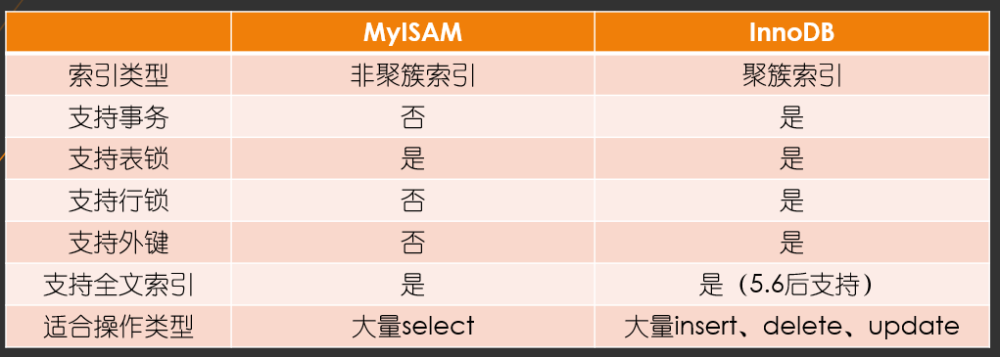

# 一条语句在MySQL里的执行过程

//TODO

# SQL无法命中索引的几种情况

最左前缀原则

or 

%ABC

函数

# 性能监控

show profile 查看sql语句运行时间

performance schema来更加容易的监控

show processlist 查看Mysl的服务一共有多少个连接

# 数据类型

1. 更小的通常更好
2. 简单就好
3. 尽量避免Null

> 磁盘预读：并不是用到哪个字节就读哪个字节，操作系统会将此数据相邻的数据也读进去。称之为“页”，如果不设置的话，默认为4kb
>

## char和varchar的区别（字符串类型）

char：

- 最大长度255；
- 会自动删除末尾的空格；
- 检索效率、写效率会比varchar高（以空间换时间）

应用场景：1、存储长度波动不大的数据，如MD5摘要。2、存储短字符串、经常更新的字符串。

varchar

- 使用最小的符合需求的长度
- varchar(n)n小于等于255使用额外一个字节保存长度，n>255使用额外两个字节保存长度。
- varchar(5)与varchar(255)保存同样的内容，硬盘存储空间相同，但是内存空间不同，是指定的大小。
- varchar在5.6版本之前变更长度，或者从255一下变更到255以上时，会导致锁表。

应用场景：1、存储长度波动较大的数据，如：文章，有的会很短有的会很长。2、字符串很少更新的场景，每次更新后都会重算并使用额外存储空间保存长度。3、适合保存多字节字符，如：汉子，特殊字符等。

BLOB和text类型

> 一般不会用，可以将文件路径存到数据库中
>

## 时间类型

datetime

- 占用8个字节
- 与时区无关，数据库底层时区配置，对datetime无效
- 可保存到毫秒
- 可保存时间范围大
- 不要使用字符串存储日期类型，占用空间大，损失日期类型函数的便捷性

timestamp（比较多）

- 占用4个字节
- 时间范围：1970-01-01到2038-01-19
- 精确到秒
- 采用整形存储
- 依赖数据库设置的时区
- 自动更新timestamp列的值

date

- 占用字节数比使用字符串、datetime、int存储要少，date类型只需要3个字节
- 使用date类型还可以利用日期时间函数进行日期之间的计算
- date类型用于保存1000-01-01到9999-12-31之间的日期

## 使用枚举类型替换字符串

# 三范式

设计关系型数据库时，遵从不同的规范要求，设计出合理的关系型数据库，这些不同的规范要求被称为不同的范式，各种范式呈递次规范，越高的范式数据库冗余越小。

目前关系型数据库有六种范式：第一范式（1NF）、第二范式（2NF）、第三范式（3NF）、巴斯-科德范式（BCNF）、第四范式（4NF）和第五范式（5NF，又称完美范式）。一般来说，数据库只需要满足第三范式就行了。

**第一范式：保证每列的原子性**

之前

之后

**第二范式：保证一张表只描述一件事情**

之前

之后

**第三范式----保证每列都和主键直接相关**

之前

之后

反范式（阿里规范，超过三张表，禁止使用join）

## 范式与反范式优缺点

范式优点

- 范式化的更新通常比反范式快
- 当数据较好的范式化后，很少或者没有重复的数据
- 范式化的数据比较小，可以放在内存中，操作比较快

范式缺点

- 通常需要进行关联

反范式优点

- 所有的数据都在同一张表中，可以避免关联
- 可以设计有效的索引

反范式缺点

- 表格内的数据冗余较多，删除数据时候会造成表有些有用的信息丢失

> 根据业务场景，混合使用范式与反范式

# 主键选择

**代理主键**

与业务无关的，无意义的数字序列

**自然主键**

事务属性中的自然唯一标识

推荐使用代理主键，因为不与业务耦合，因此更容易维护；一个大多数表，最好是全部表，通用的键策略能够减少需要编写的源码数量，减少系统的总体拥有成本

# 字符集选择

UTF8MB4

# 存储引擎的选择

存储引擎是数据文件的组织形式

默认innoDB存储引擎

innoDB

默认情况下，给索引进行加锁，在增删改查的时候的条件列是否是索引列，如果是就是行锁，如果不是就是表锁

MyISAM

聚簇索引：数据文件和索引文件放在一起的是聚簇索引

非聚簇索引：数据文件和索引文件不放在一起的是非聚簇索引

# 分库分表

垂直切分

按照业务来拆分，将不同的表放到不同的物理服务器，这样请求会分散到不同的物理服务器，减少单个服务器压力。

水平切分

一张表里面，1万个字段，1-1000放到一个物理服务器，1000-2000放到一个物理服务器

# 执行计划

mysql执行计划.md

//todo mysql和oracle区别

//todo 索引，数据库引擎