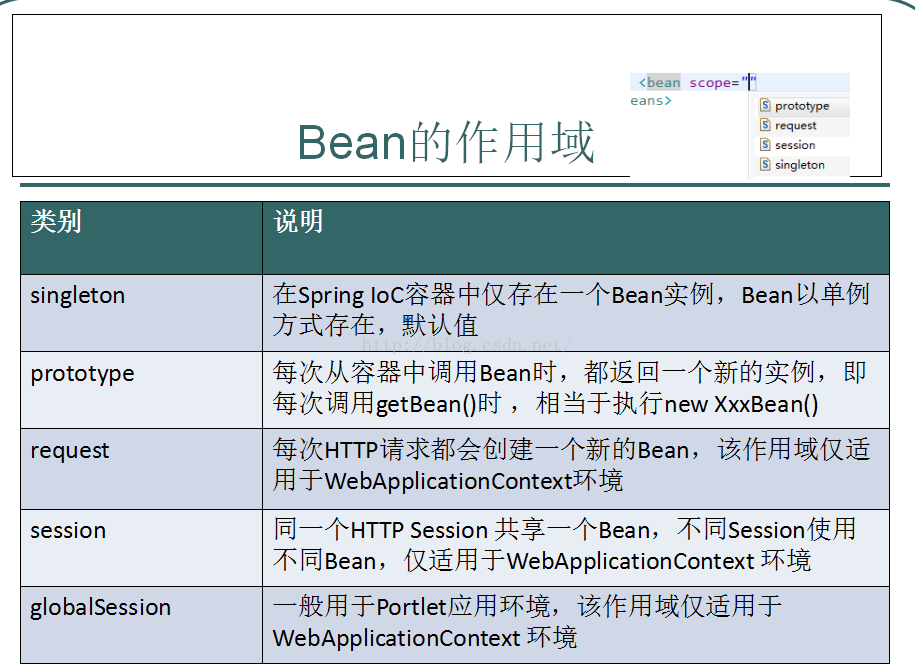
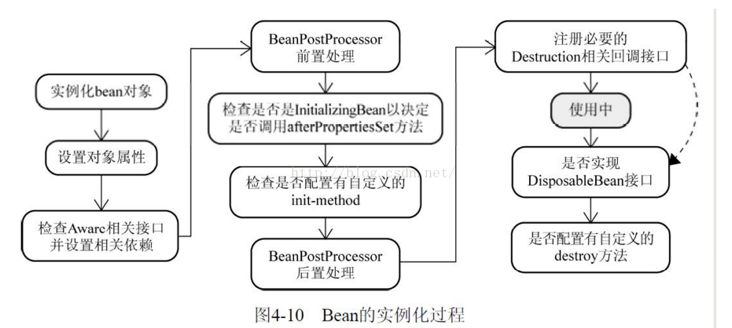

# Spring

**简介：** spring是一套java开发框架，框架的作用是减少代码的冗余和模块之间的耦合，使代码逻辑更清晰，主要是用了AOP（面向切面编程）和IOC（控制反转）容器的思想。

# AOP（面向切面编程）

主要实现的目的是针对业务处理过程中的切面进行提取，它所面对的处理过程中某个步骤或阶段，以获得逻辑过程中各部分之间低耦合性的隔离效果。

# IOC（控制反转）

是面向对象编程中的一种设计原则，可以用来降低计算机代码之间的耦合度，其中最常见的方式叫做依赖注入（DI），还有一种方式叫“依赖查找”。

通过控制反转，对象在被创建的时候，由一个调控系统内所有对象的外界实体将其所依赖的对象传递给它，也可以说，依赖被注入到对象中。

`例子：`ClassA中用到了ClassB的对象b，一般情况下，需要在A的代码中显式的new一个B的对象。而采用依赖注入技术之后，A的代码只需要定义一个私有的B对象，不需要new来获得这个对象，而是通过相关的容器控制程序来讲B对象在外部new出来并注入到A类的引用中。而具体获取的方法、对象被获取时的状态由配置文件来指定。

# 面向对象编程

将数据及对数据的操作行为放在一起，作为一个相互依存、不可分割的整体—对象。对于相同类型的对象进行分类、抽象后，得出共同的特征而形成了类。

* Spring Core: 核心类库，提供IOC服务。
* Spring Context: 提供框架式的Bean访问方式，以及企业级功能。
* Spring AOP: AOP服务。
* Spring Dao: 对JDBC的抽象，简化了数据访问异常的处理。
* Spring ORM: 对现有的ORM框架的支持。
* Spring Web: 提供了基本的面向Web的综合特征，例如多文件上传。
* Spring MVC: 提供面向Web应用的Model-View-Controller实现。

1）. 用户发请求–>DispatcherServlet，前端控制器收到请求后自己不进行处理，而是委托给其他的解析器进行处理，作为统一访问点，进行全局的流程控制。
2）.DispatcherServlet–>HandlerMapping，HandlerMapping将会把请求映射为HandlerExecutionChain对象（包含一个Handler处理器,多个HandlerInterceptor拦截器)。
3）.DispatcherServlet–>HandlerAdapter,HandlerAdapter将会把处理器包装为适配器，从而支持多种类型的处理器。
4）.HandlerAdapter–>处理器功能处理方法的调用，HandlerAdapter将会根据适配的结果调用真正的处理器的功能处理方法，完成功能处理，并返回一个ModelAndView对象(包含模型数据，逻辑视图名)
5）.ModelAndView的逻辑视图名–>ViewResolver，ViewResoler将把逻辑视图名解析为具体的View。
6）.View–>渲染，View会根据传进来的Model模型数据进行渲染，此处的Model实际是一个Map数据结构
7）.返回控制权给DispatcherServlet，由DispatcherServlet返回响应给用户。


# Bean

在spring中，那些组成应用程序的主体及由Spring Ioc容器所管理的对象，被称之为bean。简单地讲，bean就是由IoC容器初始化、装配及管理的对象，除此之外，bean就与应用程序中的其他对象没有什么区别了。而bean的定义以及bean相互间的依赖关系将通过配置元数据来描述。

## bean生命周期

Spring Bean的生命周期只有四个阶段。

1. 实例化 Instantiation
2. 属性赋值 Populate
3. 初始化 Initialization
4. 销毁 Destruction

实例化 -> 属性赋值 -> 初始化 -> 销毁

主要逻辑都在doCreate()方法中，逻辑很清晰，就是顺序调用以下三个方法，这三个方法与三个生命周期阶段一一对应，非常重要，在后续扩展接口分析中也会涉及。

1. createBeanInstance() -> 实例化
2. populateBean() -> 属性赋值
3. initializeBean() -> 初始化

```java
// 忽略了无关代码
protected Object doCreateBean(final String beanName, final RootBeanDefinition mbd, final @Nullable Object[] args)
      throws BeanCreationException {

   // Instantiate the bean.
   BeanWrapper instanceWrapper = null;
   if (instanceWrapper == null) {
       // 实例化阶段！
      instanceWrapper = createBeanInstance(beanName, mbd, args);
   }

   // Initialize the bean instance.
   Object exposedObject = bean;
   try {
       // 属性赋值阶段！
      populateBean(beanName, mbd, instanceWrapper);
       // 初始化阶段！
      exposedObject = initializeBean(beanName, exposedObject, mbd);
   }

   
}
```

至于销毁，是在容器关闭时调用的，详见`ConfigurableApplicationContext#close()`

## 常用扩展点

### 第一大类：影响多个Bean的接口

实现了这些接口的Bean会切入到多个Bean的生命周期中。正因为如此，这些接口的功能非常强大，Spring内部扩展也经常使用这些接口，例如自动注入以及AOP的实现都和他们有关。

- InstantiationAwareBeanPostProcessor
- BeanPostProcessor

这两个接口可能是Spring扩展中最重要的两个接口，InstantiationAwareBeanPostProcessor作用于实例化阶段的前后，BeanPostProcessor作用于初始化阶段的前后。正好和第一、第三个生命周期阶段对应。通过图能更好理解：


InstantiationAwareBeanPostProcessor实际上继承了BeanPostProcessor接口，严格意义上来看他们是父子关系。但是从生命周期角度我们重点关注其特有的对实例化阶段的影响，图中省略了从BeanPostProcessor继承的方法。

```java
InstantiationAwareBeanPostProcessor extends BeanPostProcessor
```

**InstantiationAwareBeanPostProcessor 源码分析：**

- postProcessBeforeInstantiation调用点，忽略无关代码

```java
@Override
    protected Object createBean(String beanName, RootBeanDefinition mbd, @Nullable Object[] args)
            throws BeanCreationException {

        try {
            // Give BeanPostProcessors a chance to return a proxy instead of the target bean instance.
            // postProcessBeforeInstantiation方法调用点，这里就不跟进了，
            // 有兴趣的同学可以自己看下，就是for循环调用所有的InstantiationAwareBeanPostProcessor
            Object bean = resolveBeforeInstantiation(beanName, mbdToUse);
            if (bean != null) {
                return bean;
            }
        }
        
        try {   
            // 上文提到的doCreateBean方法，可以看到
            // postProcessBeforeInstantiation方法在创建Bean之前调用
            Object beanInstance = doCreateBean(beanName, mbdToUse, args);
            if (logger.isTraceEnabled()) {
                logger.trace("Finished creating instance of bean '" + beanName + "'");
            }
            return beanInstance;
        }
        
    }

```

可以看到，postProcessBeforeInstantiation在doCreateBean之前调用，也就是在bean实例化之前调用的，英文源码注释解释道该方法的返回值会替换原本的Bean作为代理，这也是Aop等功能实现的关键点。

- postProcessAfterInstantiation调用点，忽略无关代码

```java
protected void populateBean(String beanName, RootBeanDefinition mbd, @Nullable BeanWrapper bw) {

   // Give any InstantiationAwareBeanPostProcessors the opportunity to modify the
   // state of the bean before properties are set. This can be used, for example,
   // to support styles of field injection.
   boolean continueWithPropertyPopulation = true;
    // InstantiationAwareBeanPostProcessor#postProcessAfterInstantiation()
    // 方法作为属性赋值的前置检查条件，在属性赋值之前执行，能够影响是否进行属性赋值！
   if (!mbd.isSynthetic() && hasInstantiationAwareBeanPostProcessors()) {
      for (BeanPostProcessor bp : getBeanPostProcessors()) {
         if (bp instanceof InstantiationAwareBeanPostProcessor) {
            InstantiationAwareBeanPostProcessor ibp = (InstantiationAwareBeanPostProcessor) bp;
            if (!ibp.postProcessAfterInstantiation(bw.getWrappedInstance(), beanName)) {
               continueWithPropertyPopulation = false;
               break;
            }
         }
      }
   }

   // 忽略后续的属性赋值操作代码
}
```

可以看到该方法在属性赋值方法内，但是在真正执行赋值操作之前。其返回值为boolean，返回false时可以阻断属性赋值阶段（`continueWithPropertyPopulation = false;`）

关于**BeanPostProcessor**执行阶段的源码穿插在下文Aware接口的调用时机分析中，因为部分Aware功能的就是通过它实现的。只需要先记住BeanPostProcessor在初始化前后调用就可以了。

### 第二大类：只调用一次的接口

这一大类接口的特点是功能丰富，常用于用户自定义扩展。可以分为以下两类

1. Aware类型的接口
2. 生命周期接口

**无所无知的Aware**

Aware类型接口的作用就是让我们能够拿到spring容器中的一些资源。基本能够见名知意，Aware之前的名字就是可以拿到什么资源，例如`BeanNameAware`可以拿到BeanName，以此类推。调用时机需要注意：所有的Aware方法都是在初始化阶段之前调用的。

Aware接口众多，这里同样通过分类的方式帮助大家记忆。

Aware接口具体可以分为两组，至于为什么这么分，详见下面的源码分析。如下排列顺序同样也是Aware接口的执行顺序，能够见名知意的接口不再解释。

`Aware Group1`

1. BeanNameAware
2. BeanClassLoaderAware
3. BeanFactoryAware

`Aware Group2`

1. EnvironmentAware
2. EmbeddedValueResolverAware 这个知道的人可能不多，实现该接口能够获取spring EL解析器，用户的自定义注解需要支持spel表达式的时候可以使用，非常方便。
3. ApplicationContextAware(ResourceLoaderAware/ApplicationEventPublisherAware/MessageSourceAware) 这几个接口可能让人有点懵，实际上这几个接口可以一起记，其返回值实质上都是当前的ApplicationContext对象，因为ApplicationContext是一个复合接口，如下：

```java
public interface ApplicationContext extends EnvironmentCapable, ListableBeanFactory, HierarchicalBeanFactory,
        MessageSource, ApplicationEventPublisher, ResourcePatternResolver {}
```

这里涉及到另一道面试题，ApplicationContext和BeanFactory的区别，可以从ApplicationContext继承的这几个接口入手，除去BeanFactory相关的两个接口就是ApplicationContext独有的功能，这里不详细说明。

**Aware调用时机源码分析**

详情如下，位置在上文提到的initializeBean方法详情，这也说明了Aware都是在初始化之前调用的。

```java
    // 见名知意，初始化阶段调用的方法
    protected Object initializeBean(final String beanName, final Object bean, @Nullable RootBeanDefinition mbd) {

        // 这里调用的是Group1中的三个Bean开头的Aware
        invokeAwareMethods(beanName, bean);

        Object wrappedBean = bean;
        
        // 这里调用的是Group2中的几个Aware，
        // 而实质上这里就是前面所说的BeanPostProcessor的调用点！
        // 也就是说与Group1中的Aware不同，这里是通过BeanPostProcessor（ApplicationContextAwareProcessor）实现的。
        wrappedBean = applyBeanPostProcessorsBeforeInitialization(wrappedBean, beanName);
        // 下文即将介绍的InitializingBean调用点
        invokeInitMethods(beanName, wrappedBean, mbd);
        // BeanPostProcessor的另一个调用点
        wrappedBean = applyBeanPostProcessorsAfterInitialization(wrappedBean, beanName);

        return wrappedBean;
    }
```

可以看到并不是所有的Aware接口都是用同样的方式调用。Bean XX Aware都是在代码中直接调用的，而ApplicationContext相关的Aware都是通过BeanPostProcessor#postProcessBeforeInitialization()实现的。感兴趣的可以自己看一下ApplicationContextAwareProcessor这个类的源码，就是判断当前创建的Bean是否实现了相关的Aware方法，如果实现了会调用回调方法将资源传递给Bean。

BeanPostProcessor的调用时机也能在这里体现，包围住invokeInitMethods方法，也就说明了在初始化的前后执行。

关于Aware接口的执行顺序，其实只需要记住第一组在第二组执行之前就行了。每组中各个Aware方法的调用顺序其实没有必要记，有需要的时候点进源码一看便知。

### 简单的两个生命周期接口

至于剩下的两个生命周期接口就很简单了，实例化和属性赋值都是spring帮助我们做的，能够自己实现的有初始化和销毁两个生命周期阶段。

1、InitializingBean 对应生命周期的初始化阶段，在上面源码的`invokeIniMethods(beanName, wrappedBean, mbd);`方法中调用。

有一点需要注意，因为Aware方法都是执行在初始化方法之前，所以可以在初始化方法中放心大胆的使用Aware接口获取资源，这也是我们自定义扩展spring的常用方式。

除了实现InitializingBean接口之外还能通过注解或者xml配置的方式指定初始化方法，至于这几种定义方式的调用顺序其实没有必要记，因为这几个方法对应的都是同一个生命周期，只是实现方式不同，我们一般只采用其中一种方式。

2、DisposableBean 类似于InitializingBean，对应生命周期的销毁阶段，以ConfigurableApplicationContext#close()方法作为入口，实现是通过循环取所有实现了DisposableBean接口的Bean然后调用其destroy()方法。感兴趣的可以自行跟一下源码。

# Bean作用域



五种作用域中，request、session和global session三种作用域仅在基于web的应用中使用（不必关心所采用的是什么web应用框架），只能用在基于web的Spring ApplicationContext环境。

1、当一个bean的作用域为Singleton，那么Spring Ioc容器中只会存在一个共享的bean实例，并且所有对bean的请求，只要id与该bean定义相匹配，则只会返回bean的同一实例。

**Singleton是单例类型，就是在创建容器时就同时自动创建了一个Bean对象，不管你是否使用，他都存在了，每次获取到的对象都是同一对象。**

注意，Singleton作用域是Spring中的缺省作用域。

2、当一个bean的作用域为Prototype，表示一个bean定义对应多个对象实例。Prototype作用域的bean会导致在每次对该bean请求（将其注入到另一个bean中，或者以程序的方式调用容器的getBean()方法）时都会创建一个新的bean实例。

**Prototype是原型类型，它在我们创建容器的时候并没有实例化，而是当我们获取bean的时候才会去创建一个对象，而且我们每次获取到的对象都不是同一个对象。**

根据经验，对有状态的bean应该使用prototype作用域，而对无状态的bean则应该使用singleton作用域。

3、当一个bean的作用域为Request，表示在一次HTTP请求中，一个bean定义对应一个实例；

**即每个HTTP请求都会有各自的bean实例，它们依据某个bean定义创建而成。**

该作用域仅在基于web的Spring ApplicationContext情形下有效。

4、**当一个bean的作用域为Session，表示在一个HTTP Session中，一个bean定义对应一个实例。**

该作用域仅在基于web的Spring ApplicationContext情形下有效。

5、**当一个bean的作用域为Global Session，表示在一个全局的HTTP Session中，一个bean定义对应一个实例。**

典型情况下，仅在使用portlet context的时候有效。该作用域仅在基于web的Spring ApplicationContext情形下有效。

# Bean的生命周期




Bean实例生命周期的执行过程如下：

- Spring对bean进行实例化，默认bean是单例；
- Spring对bean进行依赖注入；
- 如果bean实现了BeanNameAware接口，spring将bean的id传给setBeanName()方法；
- 如果bean实现了BeanFactoryAware接口，spring将调用setBeanFactory方法，将BeanFactory实例传进来；
- 如果bean实现了ApplicationContextAware接口，它的setApplicationContext()方法将被调用，将应用上下文的引用传入到bean中；
- 如果bean实现了BeanPostProcessor接口，它的postProcessBeforeInitialization方法将被调用；
- 如果bean实现了InitializingBean接口，spring将调用它的afterPropertiesSet接口方法，类似的如果bean使用了init-method属性声明了初始化方法，该方法也会被调用；
- 如果bean实现了BeanPostProcessor接口，它的postProcessAfterInitialization接口方法将被调用；
- 此时bean已经准备就绪，可以被应用程序使用了，他们将一直驻留在应用上下文中，直到该应用上下文被销毁；
- 若bean实现了DisposableBean接口，spring将调用它的distroy()接口方法。同样的，如果bean使用了destroy-method属性声明了销毁方法，则该方法被调用；


# Bean注入的几种类型

1. 构造方法注入
2. setter注入
3. 基于注解注入

# Spring动态代理//TODO


# Spring中的设计模式

- 单例模式
- 工厂方法模式
- 代理模式
- 模版模式


