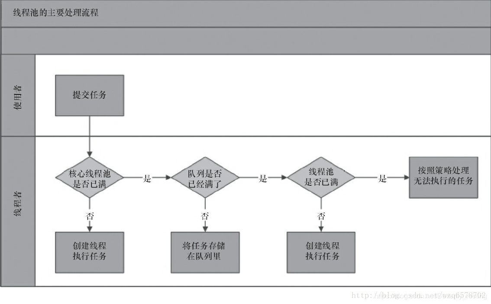

# 多线程

1、线程和进程的区别？
2、Thread和Runnable的关系，区别
3、synchronized底层如何实现？锁优化，怎么优化？多线程中 synchronized 锁升级的原理是什么？
4、Synchronized和Lock的区别？
5、synchronized和ReentrantLock有什么区别呢？ 使用场景
6、线程池的工作原理，Java 并发类库提供的线程池有哪几种？ 分别有什么特点？
7、ReentrantLock 底层实现；
8、AtomicInteger底层实现原理是什么？
9、ThreadLocal的底层原理
10、voliate 的实现原理
11、happens-before原则有哪些
12、synchronized 和 volatile 的区别是什么？
13、线程池的几种方式（类型）与使用场景，线程池都有哪些状态？
14、CountDownLatch CyclicBarrier之间的区别，使用场景
15、写一个死锁
16、死锁是什么，产生死锁的条件。如何避免死锁？怎么定位死锁线程？
17、Java中synchronized 和 ReentrantLock 有什么不同？
18、volatile 变量和 atomic 变量有什么不同？
19、Java多线程中调用wait() 和 sleep()方法有什么不同？
20、什么是Java Timer类？如何创建一个有特定时间间隔的任务？
21、什么是原子操作？在Java Concurrency API中有哪些原子类(atomic classes)？
22、一个线程两次调用 start() 方法会出现什么情况？谈谈线程的生命周期和状态转移。
23、线程的状态有哪些
24、线程的 run() 和 start() 有什么区别？
25、Runnable和Callable的区别
26、什么是CAS
27、什么是AQS
28、Semaphore有什么作用
29、进程间的通信的几种方式
30、为什么线程通信的方法wait(), notify()和notifyAll()被定义在Object类里？
31、为什么wait(), notify()和notifyAll()必须在同步方法或者同步块中被调用？
32、CopyOnWrite是什么？
33、stop()和 suspend()方法的区别
34、一个线程运行时发生异常会怎样？
35、分布式锁的实现，目前比较常用的有以下几种方案：
36、Hashtable的size()方法为什么要做同步？
37、ConcurrentHashMap 的size()方法如何实现同步的？
38、线程池会有哪些漏洞/安全问题
39、notify和notifyAll方法的区别
40、如何判断线程是否安全？

答案：

## 线程和进程的区别？

根本区别：进程是操作系统资源分配的基本单位，而线程是任务调度和执行的基本单位。
地址空间：同一进程的线程共享本进程的地址空间，而进程之间则是独立的地址空间。
关系：一个程序至少一个进程，一个进程至少一个线程。

Thread和Runnable的关系，区别

- Thread是实现了Runnable接口的类，使得run支持多线程。
- 因类的单一继承原则，推荐多使用Runnable接口

1） 如果一个类继承Thread，则不适合资源共享。但是如果实现了Runable接口的话，则很容易的实现资源共享。
2） Runnable 是接口。Thread 是类，且实现了Runnable接口。
3） 实现Runnable接口相比继承Thread类有如下好处：避免继承的局限，一个类可以实现多个接口。

## synchronized底层如何实现？锁优化，怎么优化？

synchronized 是 Java 内建的同步机制，所以也有人称其为 Intrinsic Locking，它提供了互斥的语义和可见性，当一个线程已经获取当前锁时，其他试图获取的线程只能等待或者阻塞在那里。

### 原理

synchronized可以保证方法或者代码块在运行时，同一时刻只有一个方法可以进入到临界区，同时它还可以保证共享变量的内存可见性

### 底层实现
1）同步代码块是使用monitorenter和monitorexit指令实现的，当且一个monitor被持有之后，他将处于锁定状态。线程执行到monitorenter指令时，将会尝试获取对象所对应的monitor所有权，即尝试获取对象的锁；
2）同步方法（在这看不出来需要看JVM底层实现）依靠的是方法修饰符上的ACC_SYNCHRONIZED实现。 synchronized方法是在Class文件的方法表中将该方法的access_flags字段中的synchronized标志位置1，表示该方法是同步方法并使用调用该方法的对象或该方法所属的Class在JVM的内部对象表示 Klass 做为锁对象。

Java对象头和monitor是实现synchronized的基础！
synchronized存放的位置:
synchronized用的锁是存在Java对象头里的。
其中， Java对象头包括：
Mark Word（标记字段）： 用于存储对象自身的运行时数据， 如哈希码（HashCode）、GC分代年龄、锁状态标志、线程持有的锁、偏向线程 ID、偏向时间戳等等。它是实现轻量级锁和偏向锁的关键
Klass Pointer（类型指针）： 是对象指向它的类元数据的指针，虚拟机通过这个指针来确定这个对象是哪个类的实例
monitor: 可以把它理解为一个同步工具， 它通常被描述为一个对象。 是线程私有的数据结构。

### 锁优化，怎么优化？

jdk1.6对锁的实现引入了大量的优化。 锁主要存在四中状态，依次是：无锁状态、偏向锁状态、轻量级锁状态、重量级锁状态，他们会随着竞争的激烈而逐渐升级。 注意锁可以升级不可降级，这种策略是为了提高获得锁和释放锁的效率。 重量级锁降级发生于STW阶段，降级对象为仅仅能被VMThread访问而没有其他JavaThread访问的对象。（ HotSpot JVM/JRockit JVM是支持锁降级的）

**锁升级**：

+ **偏向锁**：第一个访问某把锁的线程，sync (object) ，先在Object的头上面的markword记录这个线程（线程号），没有加锁。如果有线程争用，升级为 **自旋锁**
+ **自旋锁**：默认自旋10次后，如果还得不到这把锁。升级为**重量级锁**
+ **重量级锁**：去OS系统申请资源。

自旋锁占用CPU资源，重量级锁不占用CPU资源，所以执行时间长、线程多重量级锁更好。执行时间短、线程少用自旋锁。

### 锁的升级的目的

锁升级是为了减低了锁带来的性能消耗。在 Java 6 之后优化 synchronized 的实现方式，使用了偏向锁升级为轻量级锁再升级到重量级锁的方式，从而减低了锁带来的性能消耗。

## Synchronized和Lock的区别？
1）实现层面：synchronized（JVM层面）、Lock（JDK层面）
2）响应中断：Lock 可以让等待锁的线程响应中断，而使用synchronized时，等待的线程会一直等待下去，不能够响应中断；
3）立即返回：可以让线程尝试获取锁，并在无法获取锁的时候立即返回或者等待一段时间，而synchronized却无法办到；
4）读写锁：Lock可以提高多个线程进行读操作的效率
5）可实现公平锁：Lock可以实现公平锁，而sychronized天生就是非公平锁
6）显式获取和释放：synchronized在发生异常时，会自动释放线程占有的锁，因此不会导致死锁现象发生；而Lock在发生异常时，如果没有主动通过unLock()去释放锁，则很可能造成死锁现象，因此使用Lock时需要在finally块中释放锁；

## synchronized和ReentrantLock有什么区别呢？
synchronized 是 Java 内建的同步机制，所以也有人称其为 Intrinsic Locking，它提供了互斥的语义和可见性，当一个线程已经获取当前锁时，其他试图获取的线程只能等待或者阻塞在那里。
ReentrantLock，通常翻译为再入锁，是 Java 5 提供的锁实现，它的语义和 synchronized 基本相同。与此同时，ReentrantLock 提供了很多实用的方法，能够实现很多 synchronized 无法做到的细节控制。编码中也需要注意，必须要明确调用 unlock() 方法释放，不然就会一直持有该锁。

1）ReentrantLock 使用起来比较灵活，可以对获取锁的等待时间进行设置，可以获取各种锁的信息，但是必须有释放锁的配合动作；
2）ReentrantLock 必须手动获取与释放锁，而 synchronized 不需要手动释放和开启锁；
3）ReentrantLock 只适用于代码块锁，而 synchronized 可用于修饰方法、代码块等。
4）synchronized是关键字，ReentrantLock是类
5）Synchronized是依赖于JVM实现的，而ReenTrantLock是JDK实现的
6）ReenTrantLock可以指定是公平锁还是非公平锁。而synchronized只能是非公平锁。
7）ReenTrantLock提供了一个Condition（条件）类，用来实现分组唤醒需要唤醒的线程们，而不是像synchronized要么随机唤醒一个线程要么唤醒全部线程。
8）ReenTrantLock提供了一种能够中断等待锁的线程的机制，通过lock.lockInterruptibly()来实现这个机制。

场景：
在确实需要一些 synchronized 所没有的特性的时候，比如时间锁等候、可中断锁等候、无块结构锁、多个条件变量或者锁投票。 ReentrantLock 还具有可伸缩性的好处，应当在高度争用的情况下使用它，但是请记住，大多数 synchronized 块几乎从来没有出现过争用，所以可以把高度争用放在一边。我建议用 synchronized 开发

## 线程池的工作原理 ，Java 并发类库提供的线程池有哪几种？ 分别有什么特点？
1）线程池判断核心线程池里的线程是否都在执行任务。如果不是，则创建一个新的工作线程来执行任务。如果核心线程池里的线程都在执行任务，则进入下个流程。
2）线程池判断工作队列是否已经满。如果工作队列没有满，则将新提交的任务存储在这个工作队列里。如果工作队列满了，则进入下个流程。
3）线程池判断线程池的线程是否都处于工作状态。如果没有，则创建一个新的工作线程来执行任务。如果已经满了，则交给饱和策略来处理这个任务。

### 先讲下作用
减少资源的开销 可以减少每次创建销毁线程的开销提高响应速度 由于线程已经创建成功提高线程的可管理性

### 讲实现线程池
主要有两部分组成，多个工作线程和一个阻塞队列。其中 工作线程是一组已经处在运行中的线程，它们不断地向阻塞队列中领取任务执行。而 阻塞队列用于存储工作线程来不及处理的任务。

### 细分讲下线程的组成创建一个线程池需要要的一些核心参数。
corePoolSize：基本线程数量 它表示你希望线程池达到的一个值。线程池会尽量把实际线程数量保持在这个值上下。

maximumPoolSize：最大线程数量 这是线程数量的上界。 如果实际线程数量达到这个值： 阻塞队列未满：任务存入阻塞队列等待执行 阻塞队列已满：调用饱和策略 。

keepAliveTime：空闲线程的存活时间 当实际线程数量超过corePoolSize时，若线程空闲的时间超过该值，就会被停止。 PS：当任务很多，且任务执行时间很短的情况下，可以将该值调大，提高线程利用率。

timeUnit：keepAliveTime的单位

runnableTaskQueue：任务队列 这是一个存放任务的阻塞队列，可以有如下几种选择：

1）ArrayBlockingQueue 它是一个由数组实现的阻塞队列，FIFO。

2） LinkedBlockingQueue 它是一个由链表实现的阻塞队列，FIFO。 吞吐量通常要高于

3）ArrayBlockingQueue。fixedThreadPool使用的阻塞队列就是它。 它是一个无界队列。 

4）SynchronousQueue 它是一个没有存储空间的阻塞队列，任务提交给它之后必须要交给一条工作线程处理；如果当前没有空闲的工作线程，则立即创建一条新的工作线程。 cachedThreadPool用的阻塞队列就是它。 它是一个无界队列。

5）PriorityBlockingQueue 它是一个优先权阻塞队列。

handler：饱和策略 当实际线程数达到maximumPoolSize，并且阻塞队列已满时，就会调用饱和策略。

AbortPolicy 默认。直接抛异常。 CallerRunsPolicy 只用调用者所在的线程执行任务。 DiscardOldestPolicy 丢弃任务队列中最久的任务。 DiscardPolicy 丢弃当前任务。

### Java 并发类库提供的线程池有哪几种？ 分别有什么特点？
Executors 目前提供了 5 种不同的
线程池创建配置：
1）newCachedThreadPool()：用来处理大量短时间工作任务的线程池。当无缓存线程可用时，就会创建新的工作线程；如果线程闲置的时间超过 60 秒，则被终止并移出缓存；其内部使用 SynchronousQueue 作为工作队列。
2）newFixedThreadPool(int nThreads)，重用指定数目（nThreads）的线程，其背后使用的是无界的工作队列，任何时候最多有 nThreads 个工作线程是活动的。
3）newSingleThreadExecutor()，它的特点在于工作线程数目被限制为 1，操作一个无界的工作队列，所以它保证了所有任务的都是被顺序执行，最多会有一个任务处于活动状态
4）newSingleThreadScheduledExecutor() 和 newScheduledThreadPool(int corePoolSize)，创建的是个 ScheduledExecutorService，可以进行定时或周期性的工作调度，区别在于单一工作线程还是多个工作线程。
5）newWorkStealingPool(int parallelism)，Java 8 才加入这个创建方法，并行地处理任务，不保证处理顺序。
6）ThreadPoolExecutor()：是最原始的线程池创建，上面1-3创建方式都是对ThreadPoolExecutor的封装。

