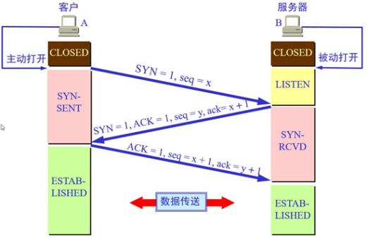

# 三次握手

## TCP报文格式简介

**其中比较重要的字段有：**

**（1）序号（sequence number）：**Seq序号，占32位，用来标识从TCP源端向目的端发送的字节流，发起方发送数据时对此进行标记。

**（2）确认号（acknowledgement number）：**Ack序号，占32位，只有ACK标志位为1时，确认序号字段才有效，Ack=Seq+1。

**（3）标志位（Flags）：**共6个，即URG、ACK、PSH、RST、SYN、FIN等，具体含义如下：

- URG：紧急指针（urgent pointer）有效。
- ACK：确认序号有效。
- PSH：接收方应该尽快将这个报文交给应用层。
- RST：重置连接。
- SYN：发起一个新连接。
- FIN：释放一个连接。

**需要注意的是：**

- 不要将确认序号Ack与标志位中的ACK搞混了。
- 确认方Ack=发起方Seq+1，两端配对。

## 三次握手

所谓的三次握手即TCP连接的建立。这个连接必须是一方主动打开，另一方被动打开的。
以下为客户端主动发起连接的图解：

握手之前主动打开连接的客户端结束CLOSED阶段，被动打开的服务器端也结束CLOSED阶段，并进入LISTEN阶段。随后开始“三次握手”：

**（1）**首先客户端向服务器端发送一段TCP报文，其中：
**标记位**为SYN，表示“请求建立新连接”;
**序号**为Seq=X（X一般为1）；
随后客户端进入SYN-SENT阶段。

**（2）**服务器端接收到来自客户端的TCP报文之后，结束LISTEN阶段。并返回一段TCP报文，其中：
**标志位**为SYN和ACK，表示“确认客户端的报文Seq序号有效，服务器能正常接收客户端发送的数据，并同意创建新连接”（即告诉客户端，服务器收到了你的数据）；
**序号**为Seq=y；
**确认号**为Ack=x+1，表示收到客户端的序号Seq并将其值加1作为自己确认号Ack的值；随后服务器端进入SYN-RCVD阶段。

**（3）**客户端接收到来自服务器端的确认收到数据的TCP报文之后，明确了从客户端到服务器的数据传输是正常的，结束SYN-SENT阶段。并返回最后一段TCP报文。其中：
**标志位**为ACK，表示“确认收到服务器端同意连接的信号”（即告诉服务器，我知道你收到我发的数据了）；
**序号**为Seq=x+1，表示收到服务器端的确认号Ack，并将其值作为自己的序号值；
**确认号**为Ack=y+1，表示收到服务器端序号Seq，并将其值加1作为自己的确认号Ack的值；
随后客户端进入ESTABLISHED阶段。

服务器收到来自客户端的“确认收到服务器数据”的TCP报文之后，明确了从服务器到客户端的数据传输是正常的。结束SYN-SENT阶段，进入ESTABLISHED阶段。

在客户端与服务器端传输的TCP报文中，双方的确认号Ack和序号Seq的值，都是在彼此Ack和Seq值的基础上进行计算的，这样做保证了TCP报文传输的连贯性。一旦出现某一方发出的TCP报文丢失，便无法继续"握手"，以此确保了"三次握手"的顺利完成。

**此后客户端和服务器端进行正常的数据传输。这就是“三次握手”的过程。**

## 四次挥手

**（1）**客户端进程发出连接释放报文，并且停止发送数据。释放数据报文首部，FIN=1，其序列号为seq=u（等于前面已经传送过来的数据的最后一个字节的序号加1），此时，客户端进入FIN-WAIT-1（终止等待1）状态。 TCP规定，FIN报文段即使不携带数据，也要消耗一个序号。

**（2）**服务器收到连接释放报文，发出确认报文，ACK=1，ack=u+1，并且带上自己的序列号seq=v，此时，服务端就进入了CLOSE-WAIT（关闭等待）状态。TCP服务器通知高层的应用进程，客户端向服务器的方向就释放了，这时候处于半关闭状态，即客户端已经没有数据要发送了，但是服务器若发送数据，客户端依然要接受。这个状态还要持续一段时间，也就是整个CLOSE-WAIT状态持续的时间。

**（3）**客户端收到服务器的确认请求后，此时，客户端就进入FIN-WAIT-2（终止等待2）状态，等待服务器发送连接释放报文（在这之前还需要接受服务器发送的最后的数据）。

**（4）**服务器将最后的数据发送完毕后，就向客户端发送连接释放报文，FIN=1，ack=u+1，由于在半关闭状态，服务器很可能又发送了一些数据，假定此时的序列号为seq=w，此时，服务器就进入了LAST-ACK（最后确认）状态，等待客户端的确认。

**（5）**客户端收到服务器的连接释放报文后，必须发出确认，ACK=1，ack=w+1，而自己的序列号是seq=u+1，此时，客户端就进入了TIME-WAIT（时间等待）状态。注意此时TCP连接还没有释放，必须经过2∗∗MSL（最长报文段寿命）的时间后，当客户端撤销相应的TCB后，才进入CLOSED状态。

**（6）**服务器只要收到了客户端发出的确认，立即进入CLOSED状态。同样，撤销TCB后，就结束了这次的TCP连接。可以看到，服务器结束TCP连接的时间要比客户端早一些。

# Get和POST

## 对比

|                | Get                                                          | post                                                         |
| -------------- | ------------------------------------------------------------ | ------------------------------------------------------------ |
| url可见性      | 参数url可见                                                  | url参数不可见                                                |
| 数据传输上     | 通过拼接url进行传递参数                                      | 通过body体传递参数                                           |
| 缓存性         | 可以缓存                                                     | 不可以缓存                                                   |
| 后退页面的反应 | get请求页面后退时，   不产生影响                             | Post请求页面后退时，   会重新提交请求                        |
| 传输数据的大小 | get一般传输数据大小不超过2k-4K   （根据浏览器不同，限制不一样，但相差不大） | Post请求传输数据的大小根据   php.ini配置文件设定，可以无限大 |
| 安全性         | 原则上post要比get安全，毕竟传输参数url不可见，但也可以抓包看到信息。所以都不是很安全。 |                                                              |

Post用于修改和写入数据。get一般用于搜索排序和筛选之类的操作，目的是资源的获取，读取数据。

## **Post请求过程：**

浏览器请求tcp连接（第一次握手）

服务器应答进行tcp连接（第二次握手）

浏览器确认，并发送Post请求头（第三次握手，这个报文比较小，所以http会在此时进行第一次数据发送）

服务器返回100 Continue响应

浏览器发送数据

服务器返回200 ok 响应

## **Get请求过程：**

浏览器请求tcp连接（第一次握手）

服务器应答进行tcp连接（第二次握手）

浏览器确认，并发送get请求头和数据（第三次握手）

服务器返回200 OK 响应

