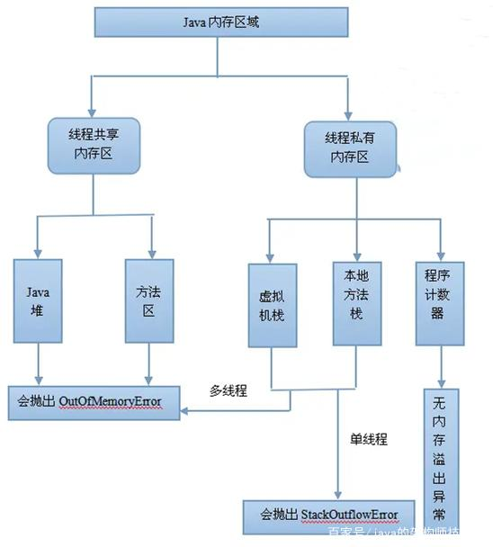

# 事务无法生效情形

1、数据库不支持

事务生效的前提是你的数据源得支持事务，比如mysql的MyISAM引擎不支持事务，而Innodb支持事务。

2、类内部访问

简单来讲就是指非直接访问带注解标记的方法B，而是通过类的普通方法A，然后由A访问B

```java
/**
 * 非直接调用，不生效
 *
 * @param id
 * @return
 * @throws Exception
 */
@Transactional(rollbackFor = Exception.class)
public boolean testCompileException2(int id) throws Exception {
    if (this.updateName(id)) {
        this.query("after update name", id);
        if (this.update(id)) {
            return true;
        }
    }

    throw new Exception("参数异常");
}

public boolean testCall(int id) throws Exception {
    return testCompileException2(id);
}
```

上面两个方法，直接调用testCompleException方法，事务正常操作；而通过调用testCall间接访问，事务不生效。

3、私有方法

在私有方法上，添加@Transactional注解也不会生效，私有方法外部不能访问，所以只能内部访问，上面的case不生效，这个当然也不会生效。

4、异常不匹配

@Transactional注解默认处理运行时异常，既只有抛出运行时异常时，才会触发事务回滚，否则不会生效。

5、多线程

这个场景可能并不多见，在标记事务的方法内部，另起子线程执行db操作，此时事务同样不会生效

下面给出两个姿势，一个是子线程抛出异常，主线程OK，一个是子线程OK，主线程抛异常。

```java
/**
 * 子线程抛异常，主线程无法捕获，导致事务不生效
 *
 * @param id
 * @return
 */
@Transactional(rollbackFor = Exception.class)
public boolean testMultThread(int id) throws InterruptedException {
    new Thread(new Runnable() {
        @Override
        public void run() {
            updateName(id);
            query("after update name", id);
        }
    }).start();

    new Thread(new Runnable() {
        @Override
        public void run() {
            boolean ans = update(id);
            query("after update id", id);
            if (!ans) {
                throw new RuntimeException("failed to update ans");
            }
        }
    }).start();

    Thread.sleep(1000);
    System.out.println("------- 子线程 --------");

    return true;
}
```

上面这种场景不生效很好理解，子线程的异常不会被外部的线程捕获，`testMultThread`这个方法的调用不抛异常，因此不会触发事务回滚

```java
/**
 * 子线程抛异常，主线程无法捕获，导致事务不生效
 *
 * @param id
 * @return
 */
@Transactional(rollbackFor = Exception.class)
public boolean testMultThread2(int id) throws InterruptedException {
    new Thread(new Runnable() {
        @Override
        public void run() {
            updateName(id);
            query("after update name", id);
        }
    }).start();

    new Thread(new Runnable() {
        @Override
        public void run() {
            boolean ans = update(id);
            query("after update id", id);
        }
    }).start();

    Thread.sleep(1000);
    System.out.println("------- 子线程 --------");

    update(id);
    query("after outer update id", id);

    throw new RuntimeException("failed to update ans");
}
```

上面这个看着好像没有毛病，抛出线程，事务回滚，可惜两个子线程的修改并不会被回滚

6、传播属性

小结

下面小结几种`@Transactional`注解事务不生效的 case

- 数据库不支持事务
- 注解放在了私有方法上
- 类内部调用（可以手动获取spring bean）
- 未捕获异常
- 多线程场景
- 传播属性设置问题

# SpringMVC工作原理


1、 用户发送请求至前端控制器DispatcherServlet。

2、 DispatcherServlet收到请求调用HandlerMapping处理器映射器。

3、 处理器映射器找到具体的处理器(可以根据xml配置、注解进行查找)，生成处理器对象及处理器拦截器(如果有则生成)一并返回给DispatcherServlet。

4、 DispatcherServlet调用HandlerAdapter处理器适配器。

5、 HandlerAdapter经过适配调用具体的处理器(Controller，也叫后端控制器)。

6、 Controller执行完成返回ModelAndView。

7、 HandlerAdapter将controller执行结果ModelAndView返回给DispatcherServlet。

8、 DispatcherServlet将ModelAndView传给ViewReslover视图解析器。

9、 ViewReslover解析后返回具体View。

10、DispatcherServlet根据View进行渲染视图（即将模型数据填充至视图中）。

11、 DispatcherServlet响应用户。


# SpringBoot 常用注解

1、**@RequestMapping**

@RequestMapping 是 Spring Web 应用程序中最常被用到的注解之一。这个注解会将 HTTP 请求映射到 MVC 和 REST 控制器的处理方法上

2、**@RequestParam**

获取请求参数的值，用来处理Content-Type: 为 application/x-www-form-urlencoded编码的内容。（Http协议中，如果不指定Content-Type，则默认传递的参数就是application/x-www-form-urlencoded类型）

3、**@RequestBody**

处理HttpEntity传递过来的数据，一般用来处理非Content-Type: application/x-www-form-urlencoded编码格式的数据。

> GET请求中，因为没有HttpEntity，所以@RequestBody并不适用。
> POST请求中，通过HttpEntity传递的参数，必须要在请求头中声明数据的类型Content-Type，SpringMVC通过使用HandlerAdapter 配置的HttpMessageConverters来解析HttpEntity中的数据，然后绑定到相应的bean上。

4、**@RestController**

相当于@ResponseBody+@Controller合在一起的作用

5、**@Autowired 自动导入**

- @Autowired注解作用在构造函数、方法、方法参数、类字段以及注解上
- @Autowired注解可以实现Bean的自动注入

6、**@Transactional 事务注解**

开启事务


7、 **@SpringBootApplication**

@SpringBootApplication是一个复合注解，包含了@SpringBootConfiguration，@EnableAutoConfiguration，@ComponentScan这三个注解

- @SpringBootConfiguration 注解，继承@Configuration注解，主要用于加载配置文
- @EnableAutoConfiguration 注解，开启自动配置功能
- @ComponentScan 注解，主要用于组件扫描和自动装配

8、**@valid** 

9、Bean

主要有四种注解可以注册bean，每种注解可以任意使用，只是语义上有所差异：

1. **@Component：**可以用于注册所有bean
2. **@Repository：**主要用于注册dao层的bean
3. **@Controller：**主要用于注册控制层的bean
4. **@Service：**主要用于注册服务层的bean

10、@Scope

作用域注解

11、@Async异步请求

https://www.jianshu.com/p/2d4b89c7a3f1

**@Async异步方法不要和同步调用方法写在同一个类中。**

12、@ControllerAdvice和@RestControllerAdvice

在这个类上加上`@ControllerAdvice`或`@RestControllerAdvice`注解，这个类就配置成全局处理类了。（这个根据你的Controller层用的是`@Controller`还是`@RestController`来决定） 然后在类中新建方法，在方法上加上`@ExceptionHandler`注解并指定你想处理的异常类型，接着在方法内编写对该异常的操作逻辑，就完成了对该异常的全局处理！我们现在就来演示一下对参数校验失败抛出的`MethodArgumentNotValidException`全局处理：

```java
@RestControllerAdvice
public class ExceptionControllerAdvice {

    @ExceptionHandler(MethodArgumentNotValidException.class)
    public String MethodArgumentNotValidExceptionHandler(MethodArgumentNotValidException e) {
     // 从异常对象中拿到ObjectError对象
        ObjectError objectError = e.getBindingResult().getAllErrors().get(0);
        // 然后提取错误提示信息进行返回
        return objectError.getDefaultMessage();
    }

}
```


# Bean作用域

https://blog.csdn.net/qq_35956041/article/details/81588160

# Mysql和Oracle区别

# 内存溢出常见场景

https://baijiahao.baidu.com/s?id=1652605740506103750&wfr=spider&for=pc

内存溢出就是内存不够，引起内存溢出的原因有很多种，常见的有以下几种：

1、内存中加载的数据量过于庞大，如一次从数据库取出过多数据；

2、集合类中有对对象的引用，使用完后未清空，使得JVM不能回收；

3、代码中存在死循环或循环产生过多重复的对象实体；

4、使用的第三方软件中的BUG；

5、启动参数内存值设定的过小



（1）程序计数器：程序计数器是线程私有的，主要的作用是通过改变这个计数器的值来选取下一条需要执行的字节码指令。既然每个线程都有一个，那么这些线程的计数器是互不影响的。也不会抛出任何异常。

（2）虚拟机栈和本地方法栈：虚拟机栈描述的是java方法执行的内存模型，每个方法在执行的时候都会创建一个栈帧用于存储局部变量表、操作数栈、动态连接、方法出口等信息。本地方法栈与虚拟机栈的区别是，虚拟机栈为虚拟机执行java方法服务，而本地方法栈则为虚拟机提供native方法服务。

在单线程的操作中，无论是由于栈帧太大，还是虚拟机栈空间太小，当栈空间无法分配时，虚拟机抛出的都是StackOverflowError异常，而不会得到OutOfMemoryError异常。而在多线程环境下，则会抛出OutOfMemoryError异常。

（3）java堆和方法区：java堆区主要存放对象实例和数组等，方法区保存类信息、常量、静态变量等等。运行时常量池也是方法区的一部分。这两块区域是线程共享的区域，只会抛出OutOfMemoryError。

**实例：**

1、堆溢出

既然堆是存放实例对象的，那我们就无线创建实例对象。这样堆区迟早会满。因为我提前设置了堆区内存，所以无限创建就会抛出异常。

2、虚拟机栈和本地方法栈溢出

Java虚拟机规范中描述了两种异常：

如果线程请求的栈深度大于虚拟机所允许的最大深度，将抛出StackOverflowError异常。如果虚拟机在扩展栈时无法申请到足够的内存空间，则抛出OutOfMemoryError异常。

3、方法区和运行时常量池溢出

4、本机直接内存溢出

DirectMemory容量可通过-XX: MaxDirectMemorySize指定，如果不指定，则默认与Java堆最大值 (-Xmx指定)一样。


